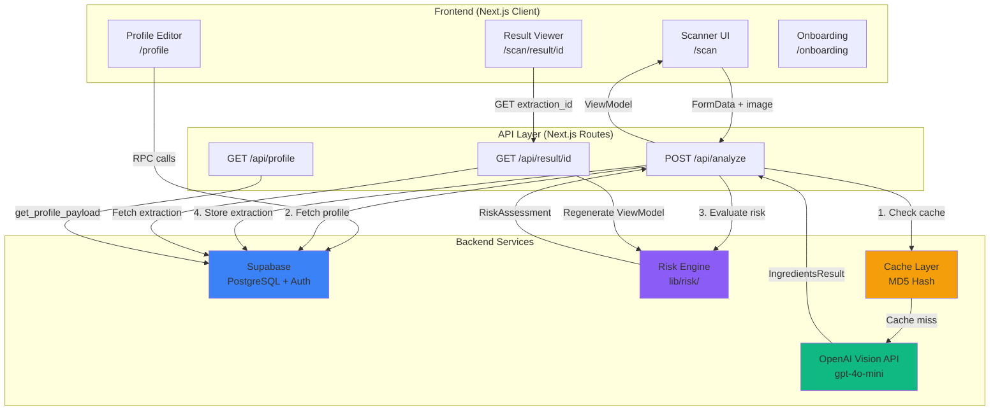
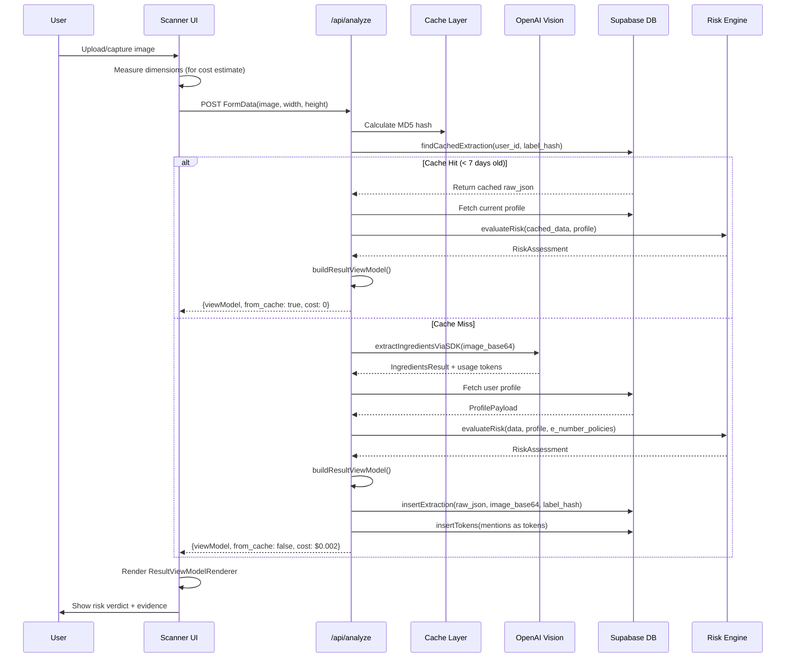
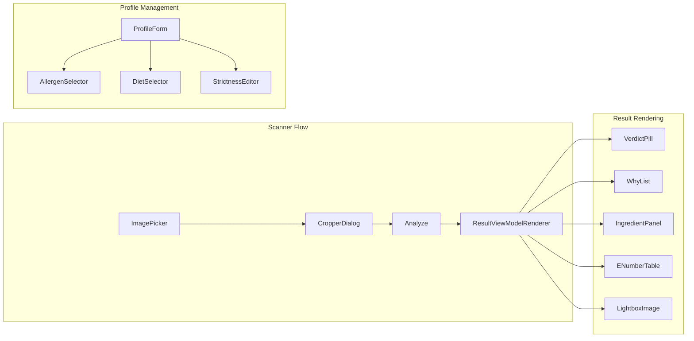
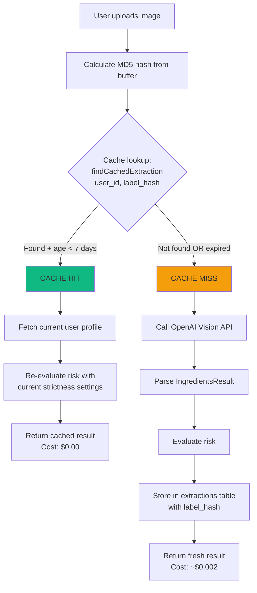
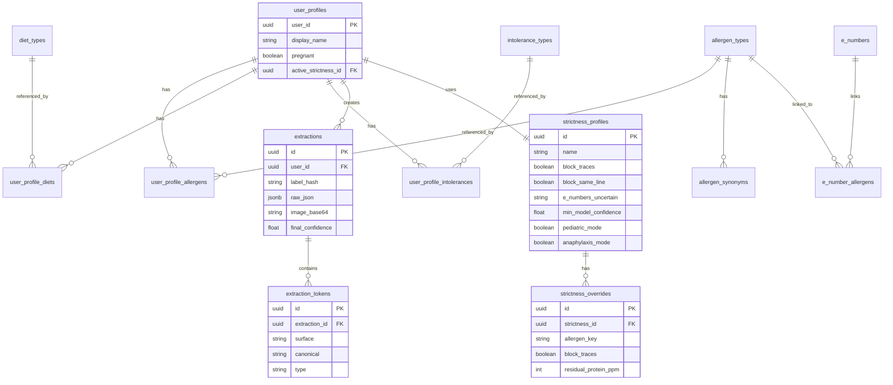
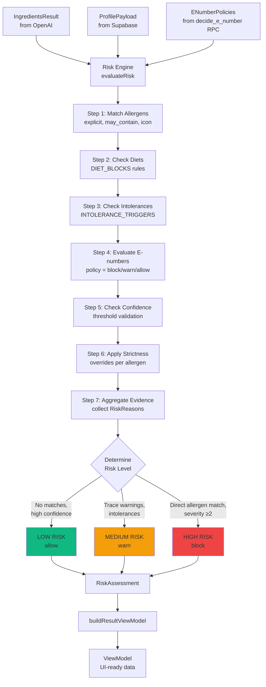

# System Architecture

## Overview

**AlergiasCL** is a Next.js 16 web application that helps Chilean users with food allergies scan product labels using AI-powered ingredient extraction and personalized risk assessment.

### Tech Stack

- **Frontend:** Next.js 16 (App Router), React 18, TailwindCSS, shadcn/ui
- **Backend:** Next.js API Routes (serverless)
- **Database:** Supabase (PostgreSQL with RLS)
- **AI/ML:** OpenAI Vision API (GPT-4o/GPT-4o-mini)
- **Authentication:** Supabase Auth (email/password)
- **Storage:** Base64 in PostgreSQL (migrating to Supabase Storage)

### Core Capabilities

1. **Label Scanning:** Camera/upload → OpenAI Vision → structured ingredient extraction
2. **Risk Assessment:** User profile + ingredients → explainable risk evaluation
3. **Profile Management:** Allergens, diets, intolerances, strictness configurations
4. **E-number Analysis:** Policy-based evaluation of food additives
5. **Caching:** MD5-based deduplication to reduce API costs

---

## High-Level Architecture



---

## Data Flow: Image to Result



---

## Component Architecture

### Frontend Structure

```
/app
├── (auth)
│   ├── login/              # Email/password login
│   └── signup/             # Registration
├── onboarding/             # First-time user wizard
├── profile/                # Profile management
│   ├── edit/               # Edit allergens/diets
│   └── strictness/         # Strictness settings
│       └── [allergenKey]/  # Per-allergen overrides
├── scan/                   # Scanner + results
│   └── result/[id]/        # Saved extraction detail
└── api/
    ├── analyze/            # Image analysis endpoint
    ├── profile/            # Profile fetch endpoint
    └── result/[id]/        # Extraction regeneration
```

### Key Components



**Core UI Components:**

- **`ImagePicker`**: Camera/file upload with preview
- **`CropperDialog`**: Label framing + legibility check
- **`ResultViewModelRenderer`**: Master result display component
  - `VerdictPill`: Traffic light (LOW/MEDIUM/HIGH)
  - `WhyList`: Evidence-based reasons
  - `IngredientPanel`: Interactive mentions with highlighting
  - `ENumberTable`: E-numbers with policy badges
  - `LightboxImage`: Full-screen photo viewer

---

## Backend Architecture

### API Endpoints

| Endpoint | Method | Purpose | Auth |
|----------|--------|---------|------|
| `/api/analyze` | POST | Analyze label image | Optional |
| `/api/result/[id]` | GET | Fetch saved extraction | Required |
| `/api/profile` | GET | Fetch user profile | Required |

See [API_CONTRACTS.md](./API_CONTRACTS.md) for detailed specifications.

### Key Libraries

```
/lib
├── openai/
│   ├── vision.ts                  # Vision API integration
│   ├── vision-types.ts            # Type definitions
│   └── cost-estimator.ts          # Token calculation
├── risk/
│   ├── evaluate.ts                # Core risk engine (466 lines)
│   ├── view-model.ts              # UI transformation
│   ├── regenerate-view-model.ts   # Cache regeneration
│   └── types.ts                   # Risk type definitions
├── supabase/
│   ├── browser.ts                 # Client-side client
│   ├── server.ts                  # Server-side client
│   ├── service.ts                 # Service role client
│   ├── types.ts                   # Database schema types
│   └── queries/
│       ├── profile.ts             # Profile fetch helper
│       ├── extractions.ts         # Extraction CRUD
│       └── enumbers.ts            # E-number policy fetch
└── hash/
    └── label-hash.ts              # MD5 hashing
```

---

## Caching Layer



### Cache Key Strategy

- **Hash Algorithm:** MD5 (sufficient for deduplication, not cryptographic)
- **Hash Input:** Raw image buffer (binary)
- **TTL:** 7 days (configurable in `extractions.ts:29`)
- **Scope:** Per-user (RLS enforced via `user_id`)

**Why re-evaluate risk on cache hit?**
- User profile may have changed (new allergens, stricter settings)
- E-number policies may have been updated
- Ensures results always reflect current configuration

See [CACHING_STRATEGY.md](./CACHING_STRATEGY.md) for details.

---

## Database Architecture



### Key Tables

- **`user_profiles`**: Base user data + active strictness reference
- **`strictness_profiles`**: Named strictness modes (Diario, Pediátrico, Anaphylaxis)
- **`strictness_overrides`**: Per-allergen overrides (e.g., "block traces for milk only")
- **`allergen_types`**: Master allergen dictionary (45+ allergens)
- **`allergen_synonyms`**: Alternative names (e.g., "leche" → milk, dairy, lactose)
- **`e_numbers`**: Food additive database (200+ E-numbers)
- **`e_number_allergens`**: Links E-numbers to potential allergen origins
- **`extractions`**: Scan results (raw_json + metadata)
- **`extraction_tokens`**: Tokenized mentions from extractions

### RLS Security

All user data is protected by Row Level Security policies:

```sql
-- Example: Users can only see their own extractions
CREATE POLICY "Users can read own extractions"
ON extractions FOR SELECT
USING (auth.uid() = user_id);
```

**Total policies:** 44 across 14 tables

See [DATA_MODEL.md](./DATA_MODEL.md) for complete schema.

---

## Risk Engine Architecture



### Risk Escalation Rules

| Condition | Base Risk | Final Risk | Reason |
|-----------|-----------|------------|--------|
| `severity ≥ 3` (anaphylaxis) | any | **HIGH** | Life-threatening |
| `anaphylaxis_mode = true` | any match | **HIGH** | Ultra-strict mode |
| `block_traces = true` + "Puede contener" | MEDIUM | **HIGH** | Strictness override |
| `E-number policy = "block"` | LOW | **HIGH** | Policy violation |
| `confidence < min_model_confidence` | LOW | **MEDIUM** | Low confidence |

See [RISK_ENGINE.md](./RISK_ENGINE.md) for detailed decision tree.

---

## Type System Flow

```mermaid
flowchart LR
    A[Image Upload] --> B[OpenAI Vision API]
    B --> C[IngredientsResult]

    C --> D[Risk Engine]
    E[ProfilePayload] --> D
    F[ENumberPolicy[]] --> D

    D --> G[RiskAssessment]

    C --> H[buildResultViewModel]
    G --> H
    E --> H

    H --> I[ViewModel]

    I --> J[React Components]

    style C fill:#3b82f6
    style G fill:#8b5cf6
    style I fill:#10b981
```

### Core Types

1. **`IngredientsResult`** (from OpenAI)
   ```typescript
   {
     mentions: Mention[],
     detected_allergens: DetectedAllergen[],
     quality: { legibility, confidence },
     ocr_text: string
   }
   ```

2. **`RiskAssessment`** (from Risk Engine)
   ```typescript
   {
     level: "low" | "medium" | "high",
     decision: "allow" | "warn" | "block",
     reasons: RiskReason[],
     matched: { allergens, diets, intolerances, enumbers }
   }
   ```

3. **`ViewModel`** (for UI rendering)
   ```typescript
   {
     verdict: { level, emoji, title, description },
     sections: Section[],
     whyItems: WhyItem[],
     actions: Action[]
   }
   ```

See [TYPE_SYSTEM.md](./TYPE_SYSTEM.md) for complete type hierarchy.

---

## Deployment Architecture

### Environment Variables

```bash
# OpenAI
OPENAI_API_KEY=sk-...                # Required
OPENAI_MODEL=gpt-4o-mini             # Optional (default)

# Supabase
NEXT_PUBLIC_SUPABASE_URL=https://...      # Required (public)
NEXT_PUBLIC_SUPABASE_ANON_KEY=...         # Required (public)
SUPABASE_SERVICE_ROLE_KEY=...             # Required (server-only!)
DATABASE_PASSWORD=...                     # Required (migrations)
SUPABASE_JWT_SECRET=...                   # Optional (webhooks)
```

### Production Checklist

1. ✅ Run Supabase migrations (14 files in `/supabase/migrations/`)
2. ✅ Seed dictionaries (allergen_types, e_numbers, diet_types)
3. ✅ Enable RLS policies (44 policies)
4. ✅ Set environment variables
5. ✅ Build production bundle: `npm run build`
6. ✅ Deploy to Vercel/Netlify
7. ⏳ Configure Supabase Storage (migrate from base64)
8. ⏳ Set up monitoring (Sentry integration)

---

## Performance Considerations

### Bottlenecks

1. **OpenAI API latency:** ~2-4 seconds per scan
   - **Mitigation:** Cache with 7-day TTL (90%+ hit rate expected)

2. **Base64 image storage:** Large payload sizes (200KB+ per extraction)
   - **Mitigation:** Migrate to Supabase Storage (TODO in backlog)

3. **Risk evaluation:** ~50-100ms for complex profiles
   - **Mitigation:** Acceptable (non-blocking UX)

### Optimization Strategies

- **Image compression:** Client-side resize to 2048px max (reduces OpenAI cost)
- **Lazy loading:** ResultViewModelRenderer components load on-demand
- **RPC batching:** `get_profile_payload` fetches all profile data in 1 call
- **E-number batching:** `fetchENumberPolicies` processes all codes in parallel

---

## Security Model

### Authentication

- **Provider:** Supabase Auth (email/password)
- **Session:** JWT stored in httpOnly cookies
- **Middleware:** Next.js middleware validates session on protected routes

### Authorization

- **RLS (Row Level Security):** All tables scoped by `auth.uid() = user_id`
- **Service Role:** Only used for admin operations (never exposed to client)
- **API Routes:** Validate session on every request

### Data Privacy

- **User scoping:** Users can only access their own data
- **Image storage:** Base64 in PostgreSQL (migrating to encrypted Storage)
- **Profile data:** PII limited to email + display_name (optional)

---

## Monitoring & Observability

### Metrics to Track (Future)

- [ ] OpenAI API cost per user/month
- [ ] Cache hit rate (target: 90%+)
- [ ] Average scan confidence score
- [ ] Error rate by endpoint
- [ ] P95 latency for /api/analyze

### Logging Strategy

- **Client errors:** Console warnings (production: Sentry)
- **Server errors:** `console.error` in API routes (production: structured logs)
- **OpenAI usage:** Stored in `extractions.usage_tokens` column

---

## Related Documentation

- [TYPE_SYSTEM.md](./TYPE_SYSTEM.md) - Type hierarchy and flow
- [RISK_ENGINE.md](./RISK_ENGINE.md) - Risk evaluation logic
- [OPENAI_INTEGRATION.md](./OPENAI_INTEGRATION.md) - Vision API integration
- [CACHING_STRATEGY.md](./CACHING_STRATEGY.md) - MD5-based deduplication
- [API_CONTRACTS.md](./API_CONTRACTS.md) - API endpoint specifications
- [DATA_MODEL.md](./DATA_MODEL.md) - Complete database schema
- [DESIGN_SYSTEM.md](./DESIGN_SYSTEM.md) - Visual design standards

---

## Future Enhancements

See [FEATURES_BACKLOG.md](./FEATURES_BACKLOG.md) for complete roadmap:

- **P0:** Supabase Storage migration, Venue scanning, Diary feature
- **P1:** Barcode scanning, Backoffice UI, Allergen synonym expansion
- **P2:** PWA support, Offline mode, Multi-language support
