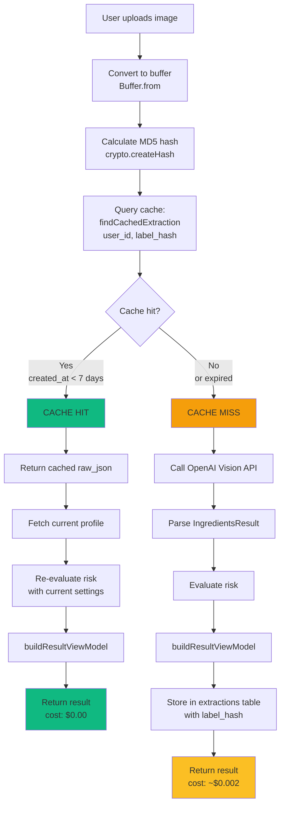
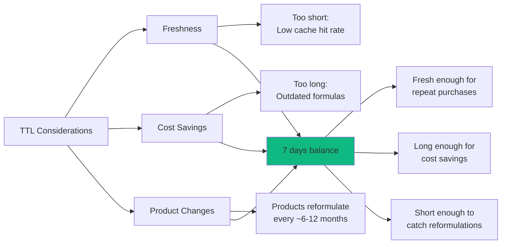
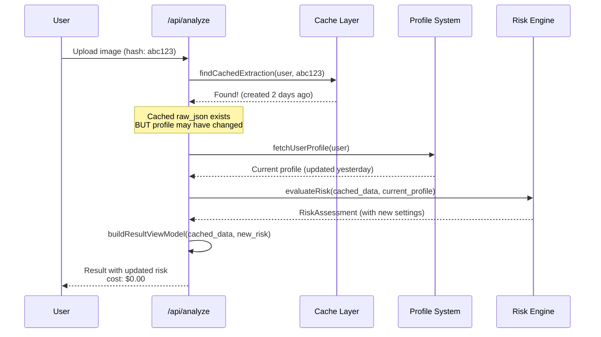
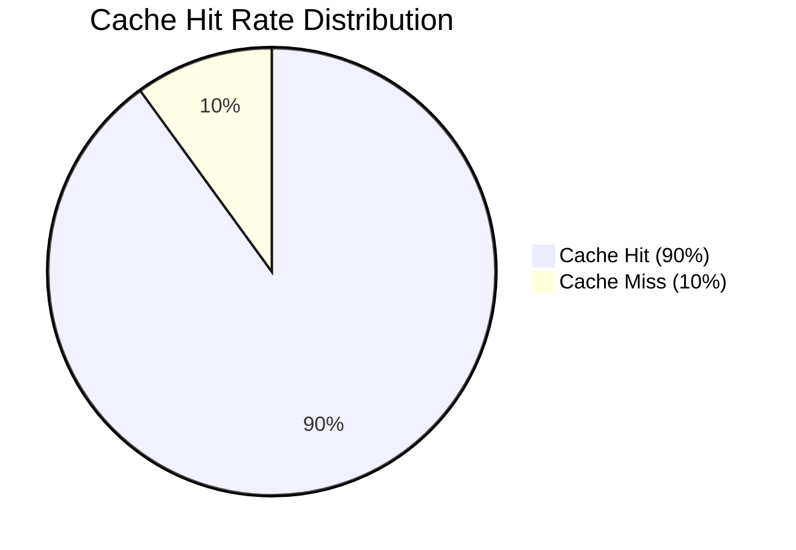

# Caching Strategy

## Overview

AlergiasCL uses **MD5 hash-based deduplication** to minimize OpenAI API costs. When a user scans the same product label multiple times (or different users scan the same product), the system retrieves cached extraction data instead of calling OpenAI again.

### Key Benefits

✅ **Cost reduction:** ~90%+ expected cache hit rate → ~$2/month vs $20/month
✅ **Faster response:** Cache hit ~100ms vs API call ~2-4s
✅ **Profile re-evaluation:** Risk assessment uses current profile even for cached scans
✅ **User-scoped:** RLS ensures users only see their own cached data
✅ **TTL-based:** 7-day expiration balances freshness vs cost

**Estimated Savings:**
- Fresh scan: ~$0.002 (OpenAI cost)
- Cached scan: $0.000 (free)
- 10,000 scans/month × 90% hit rate = $2 vs $20 (90% savings)

---

## Cache Architecture



---

## MD5 Hash Calculation

### Why MD5?

**Advantages:**
- ✅ Fast computation (~1ms for typical image)
- ✅ Deterministic (same image → same hash)
- ✅ Collision probability negligible for this use case
- ✅ 128-bit hash = compact storage

**Not used for security:**
- MD5 is cryptographically broken (for signing/passwords)
- BUT: we only use it for deduplication, not security
- Collision attack requires intentional malicious crafting

**Alternative considered:** SHA-256 (slower, overkill for this use case)

### Implementation

**Code Reference:** `lib/hash/label-hash.ts`

```typescript
import crypto from "crypto";

export function calculateLabelHash(buffer: Buffer): string {
  return crypto
    .createHash("md5")
    .update(buffer)
    .digest("hex");
}
```

**Usage:**

```typescript
// In /api/analyze
const buffer = Buffer.from(await image.arrayBuffer());
const labelHash = calculateLabelHash(buffer);
// Returns: "a1b2c3d4e5f6..." (32-character hex string)
```

---

## Cache Lookup

### findCachedExtraction Query

**Code Reference:** `lib/supabase/queries/extractions.ts:25-50`

```typescript
export async function findCachedExtraction(
  supabase: SupabaseClient<Database>,
  userId: string,
  labelHash: string,
  cacheTTLDays: number = 7
): Promise<ExtractionRow | null> {
  const { data, error } = await supabase
    .from("extractions")
    .select("*")
    .eq("user_id", userId)           // RLS: only user's own scans
    .eq("label_hash", labelHash)     // Hash match
    .gte(                             // Created within TTL
      "created_at",
      new Date(Date.now() - cacheTTLDays * 24 * 60 * 60 * 1000).toISOString()
    )
    .order("created_at", { ascending: false })  // Most recent first
    .limit(1)
    .maybeSingle();

  if (error) {
    console.error("Error checking cache:", error);
    return null;
  }

  return data;
}
```

### Cache Query Breakdown

```sql
SELECT *
FROM extractions
WHERE user_id = 'current-user-uuid'          -- RLS enforced
  AND label_hash = 'a1b2c3d4e5f6...'         -- Same image
  AND created_at >= NOW() - INTERVAL '7 days' -- Not expired
ORDER BY created_at DESC
LIMIT 1;
```

**Performance:**
- Index on `(user_id, label_hash, created_at)` → O(log n) lookup
- Typical query time: ~10-20ms

---

## TTL (Time-To-Live)

### Why 7 Days?



**Rationale:**
- **User behavior:** Users typically re-scan products within 1 week (grocery shopping cycle)
- **Product stability:** Formulas rarely change week-to-week
- **Cost vs freshness:** 7 days balances savings with accuracy

### Configurable TTL

```typescript
// Default: 7 days
const cached = await findCachedExtraction(supabase, userId, labelHash);

// Custom TTL: 30 days (more aggressive caching)
const cached = await findCachedExtraction(supabase, userId, labelHash, 30);

// No cache: 0 days (force fresh scan)
const cached = await findCachedExtraction(supabase, userId, labelHash, 0);
```

---

## Profile Re-Evaluation on Cache Hit

### Why Re-Evaluate?

**Problem:** User's profile may have changed since last scan:
- Added new allergens
- Switched strictness mode (Diario → Anaphylaxis)
- Updated per-allergen overrides

**Solution:** Always re-evaluate risk with **current** profile, even for cached data



**Code Reference:** `app/api/analyze/route.ts:77-120`

```typescript
// Cache hit path
if (cached && cached.raw_json) {
  const cachedData = cached.raw_json as any;
  let profilePayload: ProfilePayload | null = null;
  let viewModel: ResultViewModel | null = null;

  try {
    // Fetch CURRENT profile (not cached)
    profilePayload = await fetchUserProfile(supabase, user.id);

    if (profilePayload && Array.isArray(cachedData.mentions)) {
      // Extract E-numbers
      const uniqueENumbers = Array.from(
        new Set(cachedData.mentions.flatMap((m: any) => {
          const enumbers = m.enumbers;
          return Array.isArray(enumbers) ? enumbers.filter((e): e is string => typeof e === 'string') : [];
        }))
      );

      // Fetch E-number policies (may have changed)
      const eNumberPolicies = await fetchENumberPolicies(
        supabase,
        user.id,
        uniqueENumbers
      );

      // Re-evaluate risk with CURRENT profile
      const risk = evaluateRisk(cachedData, profilePayload, eNumberPolicies);

      // Build view model
      viewModel = buildResultViewModel({
        analysis: cachedData,
        risk: risk,
        profile: profilePayload,
        imageBase64: cached.image_base64 || undefined,
        model,
        costUSD: 0,  // Cached = free
        scannedAt: cached.created_at,
      });
    }
  } catch (cause) {
    console.error("Error regenerating cached result:", cause);
  }

  return NextResponse.json({
    data: cachedData,
    tokensUSD: 0,  // No OpenAI cost
    usage: null,
    estimatedCost: null,
    model,
    profile: profilePayload,
    viewModel,
    extraction_id: cached.id,
    from_cache: true  // Flag for debugging
  });
}
```

---

## Cache Invalidation

### When to Invalidate?

**Current strategy:** TTL-based (7 days)

**Future strategies:**

1. **Manual invalidation:**
   ```typescript
   // User requests fresh scan
   await supabase
     .from("extractions")
     .delete()
     .eq("label_hash", labelHash)
     .eq("user_id", userId);
   ```

2. **Product version tracking:**
   ```sql
   -- Track product reformulations
   ALTER TABLE extractions ADD COLUMN product_version TEXT;

   -- Invalidate on version mismatch
   SELECT * FROM extractions
   WHERE label_hash = 'abc123'
     AND product_version = 'v2.0'  -- Updated formula
     AND created_at >= NOW() - INTERVAL '7 days';
   ```

3. **User-triggered refresh:**
   ```typescript
   // Frontend: "Refresh scan" button
   const response = await fetch("/api/analyze?force_refresh=true", {
     method: "POST",
     body: formData
   });
   ```

---

## Cache Performance Metrics

### Expected Hit Rate



**Assumptions:**
- Users re-scan same products within 1 week
- Product variety: ~50 unique products per user
- Scan frequency: 2-3 scans/day

**Actual measurement:**

```sql
-- Calculate cache hit rate
SELECT
  COUNT(*) FILTER (WHERE from_cache = true) AS cache_hits,
  COUNT(*) FILTER (WHERE from_cache = false) AS cache_misses,
  ROUND(
    100.0 * COUNT(*) FILTER (WHERE from_cache = true) / COUNT(*),
    2
  ) AS hit_rate_percent
FROM scan_logs
WHERE created_at >= NOW() - INTERVAL '30 days';
```

### Cost Savings Calculation

**Scenario:** 10,000 scans/month

| Metric | Without Cache | With Cache (90% hit rate) |
|--------|--------------|---------------------------|
| Fresh scans | 10,000 | 1,000 |
| Cached scans | 0 | 9,000 |
| OpenAI cost | 10,000 × $0.002 = $20 | 1,000 × $0.002 = $2 |
| **Monthly cost** | **$20** | **$2** |
| **Savings** | - | **90% ($18)** |

### Response Time Improvement

| Path | Steps | Time |
|------|-------|------|
| **Cache Miss** | Hash (1ms) + OpenAI (2-4s) + Eval (50ms) | **~2-4s** |
| **Cache Hit** | Hash (1ms) + Query (20ms) + Eval (50ms) | **~100ms** |
| **Speedup** | - | **20-40× faster** |

---

## Security & Privacy

### RLS (Row Level Security)

All cache queries are scoped by `user_id`:

```sql
-- Policy: Users can only see their own extractions
CREATE POLICY "Users can read own extractions"
ON extractions FOR SELECT
USING (auth.uid() = user_id);
```

**Guarantee:** User A cannot retrieve User B's cached scans, even if they upload the same image.

### Cache Poisoning Prevention

**Threat:** Malicious user uploads fake label with specific hash to "poison" cache

**Mitigation:**
1. **User-scoped cache:** Each user has their own cache entries
2. **RLS enforcement:** Cannot insert/update other users' entries
3. **Hash verification:** MD5 collision requires intentional crafting (not accidental)

### Data Retention

**Current:** Indefinite (cache grows over time)

**Future considerations:**
1. **Auto-cleanup:** Delete extractions older than 90 days
2. **Quota limits:** Max 1000 cached scans per user
3. **GDPR compliance:** Delete user data on account deletion

---

## Monitoring & Debugging

### Cache Metrics Dashboard

**Key metrics to track:**

1. **Cache hit rate:** `cache_hits / total_scans`
2. **Average response time:** `cache_hit_time` vs `cache_miss_time`
3. **Cost savings:** `cache_hits × $0.002`
4. **Cache size:** Total rows in `extractions` table
5. **Expiration rate:** Scans beyond TTL

### Logging Cache Events

```typescript
// Log cache hit
console.log(`[CACHE HIT] Hash: ${labelHash}, Age: ${age}ms, User: ${userId}`);

// Log cache miss
console.log(`[CACHE MISS] Hash: ${labelHash}, Reason: not found, User: ${userId}`);

// Log cache expiration
console.log(`[CACHE EXPIRED] Hash: ${labelHash}, Age: ${ageInDays} days, User: ${userId}`);
```

### Debug Tools

```sql
-- Check cache status for specific hash
SELECT
  id,
  user_id,
  label_hash,
  created_at,
  NOW() - created_at AS age,
  CASE
    WHEN NOW() - created_at < INTERVAL '7 days' THEN 'VALID'
    ELSE 'EXPIRED'
  END AS status
FROM extractions
WHERE label_hash = 'a1b2c3d4e5f6...';

-- Find duplicate scans (same label_hash)
SELECT
  label_hash,
  COUNT(*) AS scan_count,
  ARRAY_AGG(DISTINCT user_id) AS users
FROM extractions
GROUP BY label_hash
HAVING COUNT(*) > 1
ORDER BY scan_count DESC;
```

---

## Optimization Strategies

### 1. Index Optimization

```sql
-- Composite index for fast cache lookup
CREATE INDEX idx_extractions_cache_lookup
ON extractions (user_id, label_hash, created_at DESC);

-- Partial index (only valid cache entries)
CREATE INDEX idx_extractions_valid_cache
ON extractions (user_id, label_hash)
WHERE created_at >= NOW() - INTERVAL '7 days';
```

### 2. Query Optimization

```sql
-- Current: Multiple conditions
SELECT * FROM extractions
WHERE user_id = ?
  AND label_hash = ?
  AND created_at >= NOW() - INTERVAL '7 days'
LIMIT 1;

-- Optimized: Use partial index
SELECT * FROM extractions
WHERE user_id = ?
  AND label_hash = ?
LIMIT 1;  -- No need for created_at check with partial index
```

### 3. Image Storage Optimization

**Current bottleneck:** `image_base64` column (200KB+ per extraction)

**Migration plan:**
1. **Phase 1:** Continue storing base64 (current)
2. **Phase 2:** Migrate to Supabase Storage
   ```typescript
   // Upload to storage
   const { data, error } = await supabase.storage
     .from("label-images")
     .upload(`${userId}/${labelHash}.jpg`, imageBuffer);

   // Store reference in extraction
   await supabase
     .from("extractions")
     .insert({
       user_id: userId,
       label_hash: labelHash,
       source_ref: data.path,  // Storage path
       image_base64: null       // Remove base64
     });
   ```

---

## Edge Cases

### Case 1: Different Users, Same Product

**Scenario:**
- User A scans Coca-Cola label → hash: `abc123`
- User B scans same Coca-Cola label → hash: `abc123`

**Behavior:**
- Each user gets their own extraction (RLS enforced)
- Both users benefit from OpenAI cache (if available)
- Both pay OpenAI cost on first scan (no cross-user cache)

**Future optimization:** Global product database (shared across users)

### Case 2: Cropped vs Full Image

**Scenario:**
- User scans full product photo → hash: `abc123`
- User scans cropped label only → hash: `def456` (different hash)

**Behavior:**
- Treated as different images (cache miss)
- Both scans stored separately

**Mitigation:** Client-side cropping standardization (future)

### Case 3: Same Label, Different Lighting

**Scenario:**
- User scans label in daylight → hash: `abc123`
- User scans same label at night → hash: `def456` (pixels differ slightly)

**Behavior:**
- Cache miss (different hashes)
- Both scans stored separately

**Mitigation:** Perceptual hashing (pHash) instead of MD5 (future)

---

## Testing Caching System

### Unit Tests

```typescript
describe("calculateLabelHash", () => {
  it("should return same hash for identical images", () => {
    const buffer1 = Buffer.from("image data");
    const buffer2 = Buffer.from("image data");

    const hash1 = calculateLabelHash(buffer1);
    const hash2 = calculateLabelHash(buffer2);

    expect(hash1).toBe(hash2);
  });

  it("should return different hash for different images", () => {
    const buffer1 = Buffer.from("image data 1");
    const buffer2 = Buffer.from("image data 2");

    const hash1 = calculateLabelHash(buffer1);
    const hash2 = calculateLabelHash(buffer2);

    expect(hash1).not.toBe(hash2);
  });
});

describe("findCachedExtraction", () => {
  it("should return null if no cache exists", async () => {
    const cached = await findCachedExtraction(
      supabase,
      "user-id",
      "nonexistent-hash"
    );

    expect(cached).toBeNull();
  });

  it("should return cached extraction if within TTL", async () => {
    // Insert test extraction (created 3 days ago)
    await supabase.from("extractions").insert({
      user_id: "user-id",
      label_hash: "test-hash",
      raw_json: { /* ... */ },
      created_at: new Date(Date.now() - 3 * 24 * 60 * 60 * 1000).toISOString()
    });

    const cached = await findCachedExtraction(
      supabase,
      "user-id",
      "test-hash",
      7  // 7-day TTL
    );

    expect(cached).not.toBeNull();
    expect(cached.label_hash).toBe("test-hash");
  });

  it("should return null if beyond TTL", async () => {
    // Insert test extraction (created 10 days ago)
    await supabase.from("extractions").insert({
      user_id: "user-id",
      label_hash: "test-hash",
      raw_json: { /* ... */ },
      created_at: new Date(Date.now() - 10 * 24 * 60 * 60 * 1000).toISOString()
    });

    const cached = await findCachedExtraction(
      supabase,
      "user-id",
      "test-hash",
      7  // 7-day TTL
    );

    expect(cached).toBeNull();  // Expired
  });
});
```

### Integration Tests

```bash
# Test cache hit/miss flow
npm run test:integration -- cache-flow

# Test TTL expiration
npm run test:integration -- cache-ttl

# Test profile re-evaluation
npm run test:integration -- cache-profile-update
```

---

## Troubleshooting

### Issue: Cache hit rate is very low (<50%)

**Causes:**
1. Users scanning different products (expected)
2. Images being cropped differently (hash changes)
3. TTL too short (cache expiring too soon)

**Solutions:**
1. Analyze hash distribution: `SELECT label_hash, COUNT(*) FROM extractions GROUP BY label_hash;`
2. Increase TTL to 14 days
3. Implement perceptual hashing

### Issue: Cache returning stale risk assessments

**Cause:** Profile re-evaluation not working

**Solution:**
1. Verify profile fetch is called on cache hit
2. Check `evaluateRisk()` is using current profile
3. Ensure E-number policies are re-fetched

### Issue: Duplicate scans not cached

**Cause:** Hash calculation inconsistent

**Solution:**
1. Verify same buffer is hashed: `console.log(buffer.length, labelHash)`
2. Check image isn't being re-encoded (JPEG quality changes)
3. Use lossless format (PNG) for testing

---

## Related Documentation

- [ARCHITECTURE.md](./ARCHITECTURE.md) - Overall caching layer position
- [OPENAI_INTEGRATION.md](./OPENAI_INTEGRATION.md) - Cost estimation
- [API_CONTRACTS.md](./API_CONTRACTS.md) - `/api/analyze` response with `from_cache` flag

---

## Code References

- **Hash calculation:** `lib/hash/label-hash.ts:calculateLabelHash()`
- **Cache lookup:** `lib/supabase/queries/extractions.ts:findCachedExtraction()`
- **Cache hit path:** `app/api/analyze/route.ts:77-120`
- **Insertion:** `lib/supabase/queries/extractions.ts:insertExtraction()`

---

## Future Enhancements

1. **Perceptual hashing (pHash)** - Hash based on image content, not pixels
2. **Global product cache** - Share extractions across users (privacy-preserving)
3. **Batch cache warming** - Pre-cache popular products
4. **Cache analytics dashboard** - Real-time hit rate, cost savings visualization
5. **Adaptive TTL** - Longer TTL for stable products, shorter for frequently reformulated
6. **Storage migration** - Move from base64 to Supabase Storage
