# E-Number Policy System

## Overview

The **E-Number System** evaluates food additives (E-numbers like E322, E471) against user allergen profiles to determine safety. Many E-numbers can be derived from allergenic sources (e.g., E322 lecithin from soy or egg), making this a critical safety feature.

### Key Capabilities

✅ **200+ E-number database** - Comprehensive Chilean food additive registry
✅ **Allergen origin tracking** - Links E-numbers to potential allergen sources
✅ **Policy-based decisions** - allow | warn | block based on user profile
✅ **Residual protein risk** - Flags E-numbers that may retain allergenic proteins
✅ **Uncertainty handling** - Configurable behavior for E-numbers with unknown origins

**Database Tables:**
- `e_numbers` (E-number master data)
- `e_number_allergens` (links E-numbers to allergen types)

**RPC Function:** `decide_e_number(p_user_id, p_code)` → policy decision

---

## Database Schema


### E-Numbers Table

```sql
CREATE TABLE e_numbers (
  code TEXT PRIMARY KEY,           -- "E322", "E471", etc.
  name_es TEXT NOT NULL,           -- "Lecitina"
  name_en TEXT,                    -- "Lecithin"
  category TEXT,                   -- "emulsifier", "preservative", etc.
  likely_origins JSONB,            -- ["soja", "girasol", "huevo"]
  residual_protein_risk BOOLEAN,  -- May retain allergenic proteins
  notes TEXT
);
```

### E-Number Allergens (Link Table)

```sql
CREATE TABLE e_number_allergens (
  e_number_code TEXT REFERENCES e_numbers(code),
  allergen_key TEXT REFERENCES allergen_types(key),
  probability REAL,  -- 0-1 (how likely this source)
  notes TEXT,
  PRIMARY KEY (e_number_code, allergen_key)
);
```

---

## Policy Decision Flow

```mermaid
flowchart TD
    A[Start: decide_e_number<br/>p_user_id, p_code] --> B{E-number exists<br/>in database?}

    B -->|No| C[Return:<br/>policy = 'unknown'<br/>exists = false]

    B -->|Yes| D[Fetch E-number data]

    D --> E[Fetch linked allergens<br/>from e_number_allergens]

    E --> F{Has linked<br/>allergens?}

    F -->|No| G{strictness:<br/>e_numbers_uncertain?}

    F -->|Yes| H[Check user allergies<br/>intersection]

    H --> I{User allergic to<br/>any linked source?}

    I -->|Yes| J[🚫 policy = 'block'<br/>reason: Allergic to source]

    I -->|No| K{residual_protein_risk<br/>= true?}

    K -->|Yes| L{strictness:<br/>e_numbers_uncertain?}
    K -->|No| M[✅ policy = 'allow'<br/>reason: No allergy match]

    L -->|'block'| N[🚫 policy = 'block'<br/>reason: Residual protein risk]
    L -->|'warn'| O[⚠️ policy = 'warn'<br/>reason: Uncertain origin]
    L -->|'allow'| M

    G -->|'block'| P[🚫 policy = 'block'<br/>reason: E-number uncertain]
    G -->|'warn'| Q[⚠️ policy = 'warn'<br/>reason: E-number uncertain]
    G -->|'allow'| R[✅ policy = 'allow'<br/>reason: No allergen link]

    J --> S[Return ENumberPolicy]
    M --> S
    N --> S
    O --> S
    P --> S
    Q --> S
    R --> S
    C --> S

    style J fill:#ef4444
    style N fill:#ef4444
    style P fill:#ef4444
    style O fill:#fbbf24
    style Q fill:#fbbf24
    style M fill:#10b981
    style R fill:#10b981
```



---

## decide_e_number RPC

### Function Signature

```sql
decide_e_number(p_user_id UUID, p_code TEXT) RETURNS json
```

### Returned Structure

```typescript
interface ENumberPolicy {
  code: string;                    // "E322"
  policy: "allow" | "warn" | "block" | "unknown";
  name_es?: string;                // "Lecitina"
  linked_allergens?: string[];     // ["soja", "huevo"]
  matched_allergens?: string[];    // Subset of linked that user is allergic to
  residual_protein_risk?: boolean; // true if proteins may remain
  reason?: string;                 // Human-readable explanation
  likely_origins?: string[];       // ["soja", "girasol", "huevo"]
  exists?: boolean;                // true if in database
}
```

### Example Responses

#### Case 1: User Allergic to Linked Source

**Input:** User has soy allergy, checks E322 (lecithin)

**Database:**
```sql
-- E322 in e_numbers
SELECT * FROM e_numbers WHERE code = 'E322';
-- { code: "E322", name_es: "Lecitina", residual_protein_risk: true }

-- E322 linked to soja and huevo
SELECT * FROM e_number_allergens WHERE e_number_code = 'E322';
-- [
--   { e_number_code: "E322", allergen_key: "soja", probability: 0.7 },
--   { e_number_code: "E322", allergen_key: "huevo", probability: 0.3 }
-- ]
```

**Output:**
```json
{
  "code": "E322",
  "policy": "block",
  "name_es": "Lecitina",
  "linked_allergens": ["soja", "huevo"],
  "matched_allergens": ["soja"],
  "residual_protein_risk": true,
  "reason": "Lecithin may be derived from soy, which you are allergic to. Residual protein risk present.",
  "likely_origins": ["soja", "girasol", "huevo"],
  "exists": true
}
```

#### Case 2: No User Allergy, But Residual Protein Risk

**Input:** User has milk allergy (not soy), checks E322

**Strictness:** `e_numbers_uncertain = "warn"`

**Output:**
```json
{
  "code": "E322",
  "policy": "warn",
  "name_es": "Lecitina",
  "linked_allergens": ["soja", "huevo"],
  "matched_allergens": [],
  "residual_protein_risk": true,
  "reason": "Lecithin has residual protein risk. Origin uncertain.",
  "likely_origins": ["soja", "girasol", "huevo"],
  "exists": true
}
```

#### Case 3: E-Number Not in Database

**Input:** User checks E999 (fictional)

**Output:**
```json
{
  "code": "E999",
  "policy": "unknown",
  "exists": false,
  "reason": "E-number not in database"
}
```

---

## Policy Decision Table

| Condition | Policy | Reason |
|-----------|--------|--------|
| **E-number not in database** | `unknown` | Not recognized |
| **User allergic to linked source** | `block` | Direct allergen match |
| **No user allergy + residual_protein_risk = true** | depends on `e_numbers_uncertain` | Uncertain origin |
| **No user allergy + residual_protein_risk = false** | `allow` | Safe, no allergen match |
| **No linked allergens + e_numbers_uncertain = 'block'** | `block` | Strictness policy |
| **No linked allergens + e_numbers_uncertain = 'warn'** | `warn` | Strictness policy |
| **No linked allergens + e_numbers_uncertain = 'allow'** | `allow` | Strictness policy |

---

## Linked Allergens Logic

### Probability Scoring

Each E-number can have multiple linked allergens with probability scores:

```sql
-- E471 (Mono- and diglycerides) can be from multiple sources
INSERT INTO e_number_allergens (e_number_code, allergen_key, probability) VALUES
  ('E471', 'leche', 0.4),   -- 40% chance from milk
  ('E471', 'soja', 0.3),    -- 30% chance from soy
  ('E471', 'palma', 0.2),   -- 20% chance from palm
  ('E471', 'girasol', 0.1); -- 10% chance from sunflower
```

**Interpretation:**
- E471 is most commonly derived from milk (40%)
- But can also be soy, palm, or sunflower
- User with milk allergy → policy = "block"

### Matched Allergens

The RPC returns `matched_allergens` as the **intersection** of:
- `linked_allergens` (from `e_number_allergens` table)
- User's allergen list (from `user_profile_allergens`)

```typescript
// Pseudocode
const linkedAllergens = ["soja", "huevo"];       // From e_number_allergens
const userAllergens = ["leche", "soja", "mani"]; // From user profile

const matchedAllergens = linkedAllergens.filter(a =>
  userAllergens.includes(a)
);
// Result: ["soja"]
```

If `matchedAllergens.length > 0`, policy is always `"block"`.

---

## Residual Protein Risk

### What is Residual Protein?

Some E-numbers (especially emulsifiers) may retain **trace amounts of allergenic proteins** even after processing:

- **E322 (Lecithin):** Can retain soy/egg proteins
- **E471 (Mono/diglycerides):** Can retain milk proteins
- **E476 (Polyglycerol polyricinoleate):** Can retain castor bean proteins

### Risk Flag

```sql
UPDATE e_numbers
SET residual_protein_risk = true
WHERE code IN ('E322', 'E471', 'E476');
```

### Impact on Policy

If `residual_protein_risk = true` AND user's strictness has `e_numbers_uncertain` set:

| e_numbers_uncertain | Policy |
|---------------------|--------|
| `"allow"` | `allow` |
| `"warn"` | `warn` |
| `"block"` | `block` |

**Example:**
- E322 has `residual_protein_risk = true`
- User is NOT allergic to soy/egg (no `matched_allergens`)
- Strictness: `e_numbers_uncertain = "warn"`
- → Policy: `"warn"` (because of residual protein risk)

---

## Strictness Integration

The E-number policy system integrates with user strictness settings:


### Strictness Levels

| Mode | e_numbers_uncertain | Behavior |
|------|---------------------|----------|
| **Diario** | `"warn"` | Warn on uncertain origins |
| **Pediátrico** | `"block"` | Block all uncertain E-numbers |
| **Anaphylaxis** | `"block"` | Block all uncertain E-numbers |

---

## Usage in Risk Engine

**Code Reference:** `lib/risk/evaluate.ts:245-280`

```typescript
// Step 1: Extract unique E-numbers from mentions
const uniqueENumbers = Array.from(
  new Set(analysis.mentions.flatMap((m) => m.enumbers))
);
// Example: ["E322", "E471", "E476"]

// Step 2: Fetch policies for all E-numbers (batch call)
const eNumberPolicies = await fetchENumberPolicies(
  supabase,
  userId,
  uniqueENumbers
);

// Step 3: Evaluate each policy
const matchedENumbers: MatchedENumber[] = [];

for (const policy of eNumberPolicies) {
  if (policy.policy === "block") {
    matchedENumbers.push({
      code: policy.code,
      decision: "block",
      policy: policy.policy,
      nameEs: policy.name_es,
      linkedAllergens: policy.linked_allergens,
      reason: policy.reason,
      mentionIds: [...] // Extract from mentions
    });
  } else if (policy.policy === "warn") {
    matchedENumbers.push({
      code: policy.code,
      decision: "warn",
      // ...
    });
  }
}

// Step 4: Escalate risk if any E-number is blocked
if (matchedENumbers.some(e => e.decision === "block")) {
  riskLevel = "high";
}
```

---

## Adding New E-Numbers

### 1. Add to e_numbers Table

```sql
INSERT INTO e_numbers (code, name_es, name_en, category, likely_origins, residual_protein_risk, notes)
VALUES (
  'E476',
  'Poliricinoleato de poliglicerol',
  'Polyglycerol polyricinoleate',
  'emulsifier',
  '["castor_bean"]',
  true,
  'Used in chocolate to reduce viscosity'
);
```

### 2. Link to Allergen Types

```sql
-- E476 may be derived from castor beans (not a common allergen, but possible)
-- If user has custom allergen "castor_bean", link it:
INSERT INTO e_number_allergens (e_number_code, allergen_key, probability, notes)
VALUES (
  'E476',
  'castor_bean',
  0.9,
  'Primary source for PGPR'
);
```

### 3. Update likely_origins (Optional)

```sql
UPDATE e_numbers
SET likely_origins = '["castor_bean", "palm"]'::jsonb
WHERE code = 'E476';
```

### 4. Verify via RPC

```sql
SELECT decide_e_number('user-uuid', 'E476');
-- Should return policy based on user's allergen profile
```

---

## Batch Policy Fetching

**Code Reference:** `lib/supabase/queries/enumbers.ts:fetchENumberPolicies()`

```typescript
export async function fetchENumberPolicies(
  supabase: SupabaseClient<Database>,
  userId: string,
  codes: string[]
): Promise<ENumberPolicy[]> {
  const policies: ENumberPolicy[] = [];

  // Call RPC for each code (could be optimized with batch RPC)
  for (const code of codes) {
    try {
      const { data, error } = await supabase.rpc("decide_e_number", {
        p_user_id: userId,
        p_code: code,
      });

      if (error) {
        console.error(`Error fetching E-number policy for ${code}:`, error);
        continue; // Skip this code, continue with others
      }

      if (data && typeof data === "object") {
        policies.push(data as unknown as ENumberPolicy);
      }
    } catch (error) {
      console.error(`Exception fetching E-number policy for ${code}:`, error);
    }
  }

  return policies;
}
```

**Optimization Opportunity:** Create a batch RPC function to fetch multiple E-numbers in one call.

---

## Common E-Numbers

### Highly Allergenic E-Numbers

| Code | Name (ES) | Linked Allergens | Residual Protein Risk |
|------|-----------|------------------|----------------------|
| **E322** | Lecitina | soja, huevo | ✅ Yes |
| **E471** | Mono/diglicéridos | leche, soja | ✅ Yes |
| **E472e** | Ésteres de glicerol | leche | ✅ Yes |
| **E901** | Cera de abejas | miel (trace) | ❌ No |
| **E920** | L-cisteína | pescado, plumas | ⚠️ Possible |
| **E1105** | Lisozima | huevo | ✅ Yes |

### Safe E-Numbers (No Common Allergens)

| Code | Name (ES) | Category | Notes |
|------|-----------|----------|-------|
| E300 | Ácido ascórbico (Vitamina C) | Antioxidant | Safe |
| E330 | Ácido cítrico | Acidulant | Safe |
| E440 | Pectina | Gelling agent | Plant-based |
| E500 | Carbonatos de sodio | Acidity regulator | Safe |

---

## E-Number Categories


---

## Testing E-Number System

### Unit Tests

```typescript
describe("decide_e_number RPC", () => {
  it("should block E322 for user with soy allergy", async () => {
    const policy = await supabase.rpc("decide_e_number", {
      p_user_id: "user-with-soy-allergy",
      p_code: "E322"
    });

    expect(policy.policy).toBe("block");
    expect(policy.matched_allergens).toContain("soja");
  });

  it("should warn on E322 for user without soy allergy but residual protein risk", async () => {
    const policy = await supabase.rpc("decide_e_number", {
      p_user_id: "user-with-milk-allergy",
      p_code: "E322"
    });

    expect(policy.policy).toBe("warn"); // Assuming e_numbers_uncertain = "warn"
    expect(policy.residual_protein_risk).toBe(true);
  });

  it("should return unknown for non-existent E-number", async () => {
    const policy = await supabase.rpc("decide_e_number", {
      p_user_id: "any-user",
      p_code: "E9999"
    });

    expect(policy.policy).toBe("unknown");
    expect(policy.exists).toBe(false);
  });
});
```

### Integration Tests

```bash
# Test E-number batch fetching
npm run test:integration -- e-number-batch

# Test strictness integration
npm run test:integration -- e-number-strictness

# Test residual protein risk
npm run test:integration -- e-number-residual-protein
```

---

## Troubleshooting

### Issue: All E-numbers return "unknown"

**Cause:** `e_numbers` table is empty

**Solution:**
1. Check seed data:
   ```sql
   SELECT COUNT(*) FROM e_numbers;
   ```
2. Run seed migration if empty:
   ```bash
   npx supabase db reset
   ```

### Issue: E-number policy always "allow" despite allergy

**Cause:** E-number not linked to allergen in `e_number_allergens`

**Solution:**
1. Verify link exists:
   ```sql
   SELECT * FROM e_number_allergens WHERE e_number_code = 'E322';
   ```
2. Add link if missing:
   ```sql
   INSERT INTO e_number_allergens (e_number_code, allergen_key, probability)
   VALUES ('E322', 'soja', 0.7);
   ```

### Issue: RPC returns null

**Cause:** RLS policy blocking query or missing user profile

**Solution:**
1. Check user profile exists:
   ```sql
   SELECT * FROM user_profiles WHERE user_id = 'user-uuid';
   ```
2. Verify RPC has correct permissions:
   ```sql
   GRANT EXECUTE ON FUNCTION decide_e_number TO authenticated;
   ```

---

## Related Documentation

- [RISK_ENGINE.md](./RISK_ENGINE.md) - How E-number policies affect risk evaluation
- [PROFILE_SYSTEM.md](./PROFILE_SYSTEM.md) - Strictness `e_numbers_uncertain` setting
- [DATA_MODEL.md](./DATA_MODEL.md) - Complete E-number schema

---

## Code References

- **Policy fetch:** `lib/supabase/queries/enumbers.ts:fetchENumberPolicies()`
- **RPC function:** Supabase migration: `20250106000014_add_rpc_functions.sql`
- **Risk evaluation:** `lib/risk/evaluate.ts:245-280`
- **Type definition:** `lib/supabase/queries/enumbers.ts:ENumberPolicy`

---

## Future Enhancements

1. **Batch RPC** - Fetch multiple E-number policies in one call
2. **E-number synonyms** - Support "lecitina" → E322 mapping
3. **Source transparency** - Show % probability for each origin
4. **User feedback** - Allow users to report E-number reactions
5. **Auto-update database** - Sync with EU/Chilean official E-number registry
6. **Machine learning** - Predict E-number risk based on user reaction history
