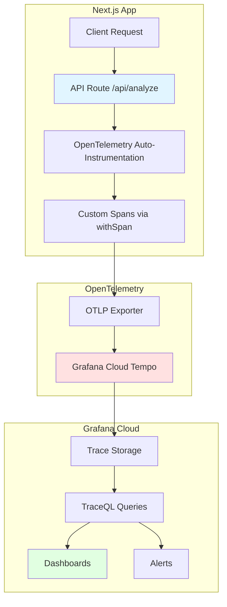
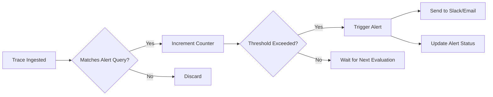
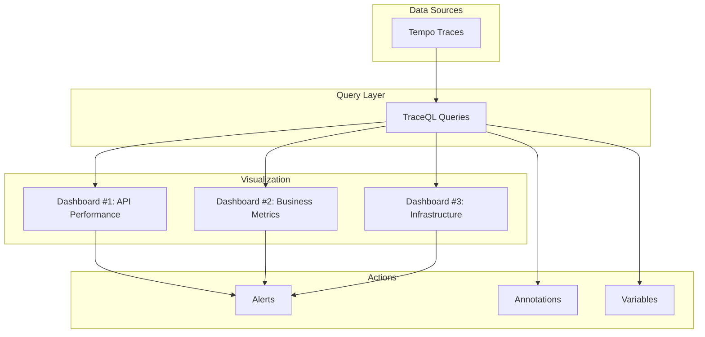

# Grafana Cloud Dashboard Configuration Guide

Complete guide for configuring observability dashboards, alerts, and queries for the Alergias App using Grafana Cloud with OpenTelemetry traces.

---

## Table of Contents

1. [Introduction](#introduction)
2. [Initial Setup](#initial-setup)
3. [Recommended Dashboards](#recommended-dashboards)
4. [Useful Queries](#useful-queries)
5. [Alert Configuration](#alert-configuration)
6. [Best Practices](#best-practices)
7. [Troubleshooting](#troubleshooting)
8. [Advanced Query Examples](#advanced-query-examples)
9. [Architecture Diagrams](#architecture-diagrams)
10. [References](#references)

---

## Introduction

### What is Grafana Cloud?

Grafana Cloud is a fully managed observability platform that provides:
- **Tempo**: Distributed tracing backend for storing and querying OpenTelemetry traces
- **Loki**: Log aggregation system
- **Prometheus**: Metrics storage and querying
- **Grafana**: Visualization and dashboarding UI

### Why We Use It

For Alergias App, we use Grafana Cloud to:
1. **Monitor API Performance**: Track response times, error rates, and throughput for `/api/analyze`
2. **Track Business Metrics**: Monitor cache hit rates, OpenAI costs, allergen detection accuracy
3. **Debug Production Issues**: Trace requests end-to-end to identify bottlenecks
4. **Optimize Costs**: Identify expensive OpenAI calls and optimize caching strategy
5. **Ensure Reliability**: Set up alerts for degraded performance or high error rates

### Architecture Overview



**Trace Flow:**
1. User uploads image → `/api/analyze` receives request
2. OpenTelemetry auto-instrumentation creates parent span
3. Custom spans track: cache lookup, OpenAI call, profile fetch, risk evaluation, persistence
4. Spans exported to Grafana Cloud via OTLP protocol
5. Traces stored in Tempo, queryable via TraceQL
6. Dashboards visualize metrics, alerts fire on anomalies

---

## Initial Setup

### Prerequisites

1. **Grafana Cloud Account**: Sign up at https://grafana.com/auth/sign-up/create-user
2. **Environment Variables**: Already configured in `.env.local` (user handles this)
3. **OpenTelemetry Package**: Already installed (`@opentelemetry/auto-instrumentations-node`)

### Verify Traces are Being Sent

**Step 1: Start the development server**
```bash
npm run dev
```

**Step 2: Send test request**
```bash
curl http://localhost:3000/api/otel-ping
```

**Step 3: Check Grafana Cloud**
1. Go to **Grafana Cloud** → **Explore** → Select **Tempo** data source
2. In **Query Type**, select **Search**
3. Filter by **Service Name**: `alergiascl`
4. Filter by **Span Name**: `GET /api/otel-ping`
5. You should see traces appear within 10-30 seconds

**Expected trace structure:**
```
GET /api/otel-ping (50ms)
  └─ Auto-instrumented HTTP span (50ms)
```

**Step 4: Test real scan**
Upload an image at `/scan` and check for this trace:
```
POST /api/analyze (2500ms)
  ├─ cache.lookup (50ms)
  ├─ openai.vision (2000ms)
  ├─ profile.fetch (100ms)
  ├─ enumbers.fetch (80ms)
  ├─ risk.evaluate (20ms)
  └─ extraction.persist (250ms)
```

---

## Recommended Dashboards

### Dashboard #1: API Performance Monitor

**Purpose**: Real-time monitoring of API health, response times, and error rates.

**Panels to Create:**

#### Panel 1.1: Request Rate (Requests per Minute)
**Visualization**: Time series line chart
**Query**:
```traceql
{
  service.name="alergiascl" &&
  name="POST /api/analyze"
} | rate()
```

**Configuration**:
- Y-axis: Requests/min
- Thresholds: Green (0-10), Yellow (10-20), Red (>20)
- Alert threshold: >15 req/min (check for traffic spikes)

#### Panel 1.2: Response Time (p50, p95, p99)
**Visualization**: Time series with multiple lines
**Query for p95**:
```traceql
{
  service.name="alergiascl" &&
  name="POST /api/analyze"
} | quantile_over_time(duration, 0.95) by (span.name)
```

**Configuration**:
- 3 separate queries for p50 (0.50), p95 (0.95), p99 (0.99)
- Y-axis: Duration (ms)
- Thresholds: Green (<3s), Yellow (3-5s), Red (>5s)

#### Panel 1.3: Error Rate
**Visualization**: Stat panel with sparkline
**Query**:
```traceql
{
  service.name="alergiascl" &&
  name="POST /api/analyze" &&
  status=error
} | rate()
```

**Configuration**:
- Display: Percentage of total requests
- Thresholds: Green (<1%), Yellow (1-5%), Red (>5%)
- Alert: Trigger if >5% for 5 minutes

#### Panel 1.4: OpenAI Latency Breakdown
**Visualization**: Bar gauge
**Query**:
```traceql
{
  service.name="alergiascl" &&
  name="openai.vision"
} | avg(duration) by (span.ai.model)
```

**Configuration**:
- Group by: AI model (gpt-4o vs gpt-4o-mini)
- Y-axis: Average duration (ms)
- Useful for comparing model performance

#### Panel 1.5: Request Waterfall (Recent Traces)
**Visualization**: Trace list
**Query**:
```traceql
{
  service.name="alergiascl" &&
  name="POST /api/analyze"
}
```

**Configuration**:
- Limit: 20 most recent traces
- Columns: Duration, Status, Span count
- Click-through to full trace view

---

### Dashboard #2: Business Metrics

**Purpose**: Track cache effectiveness, costs, and allergen detection patterns.

#### Panel 2.1: Cache Hit Rate
**Visualization**: Gauge
**Query**:
```traceql
{
  service.name="alergiascl" &&
  name="cache.lookup" &&
  span.cache.hit=true
} | rate() /
{
  service.name="alergiascl" &&
  name="cache.lookup"
} | rate()
```

**Configuration**:
- Display: Percentage (0-100%)
- Thresholds: Red (<30%), Yellow (30-50%), Green (>50%)
- Target: >60% cache hit rate

#### Panel 2.2: Average Cost per Request
**Visualization**: Stat panel
**Query** (requires custom attribute from response):
```traceql
{
  service.name="alergiascl" &&
  name="openai.vision"
} | avg(span.ai.cost_usd)
```

**Configuration**:
- Display: USD with 4 decimals ($0.0012)
- Alert: If average >$0.01 for 1 hour

**Note**: You'll need to add cost as a span attribute in `app/api/analyze/route.ts`:
```typescript
const response = await withSpan(
  "openai.vision",
  {
    "ai.model": model,
    "ai.cost_usd": tokensUSD  // Add this
  },
  async () => extractIngredientsViaSDK({...})
);
```

#### Panel 2.3: Top Detected Allergens
**Visualization**: Bar chart
**Query** (requires custom attributes):
```traceql
{
  service.name="alergiascl" &&
  name="risk.evaluate"
} | count() by (span.allergen.name)
```

**Configuration**:
- Top 10 allergens
- Useful for understanding user profile distribution

#### Panel 2.4: Risk Level Distribution
**Visualization**: Pie chart
**Query**:
```traceql
{
  service.name="alergiascl" &&
  name="risk.evaluate"
} | count() by (span.risk.level)
```

**Expected distribution**:
- Low: ~60%
- Medium: ~30%
- High: ~10%

#### Panel 2.5: Cache vs Fresh Requests
**Visualization**: Stacked bar chart
**Query for cached**:
```traceql
{
  service.name="alergiascl" &&
  name="POST /api/analyze" &&
  !exists(name="openai.vision")
}
```

**Query for fresh**:
```traceql
{
  service.name="alergiascl" &&
  name="POST /api/analyze" &&
  exists(name="openai.vision")
}
```

---

### Dashboard #3: Infrastructure Metrics

**Purpose**: Monitor server health, resource usage, and concurrency.

#### Panel 3.1: Active Spans (Concurrency)
**Visualization**: Time series
**Query**:
```traceql
{
  service.name="alergiascl"
} | rate()
```

**Configuration**:
- Shows concurrent request handling
- Alert: If >50 concurrent spans (sign of traffic spike or hanging requests)

#### Panel 3.2: Span Duration by Operation
**Visualization**: Heatmap
**Query**:
```traceql
{
  service.name="alergiascl"
} | histogram(duration) by (span.name)
```

**Configuration**:
- X-axis: Time
- Y-axis: Duration buckets (0-100ms, 100-500ms, 500ms-1s, 1s-5s, >5s)
- Color: Request count
- Useful for spotting performance degradation patterns

#### Panel 3.3: Database Query Performance
**Visualization**: Bar gauge
**Query**:
```traceql
{
  service.name="alergiascl" &&
  (name="profile.fetch" || name="enumbers.fetch" || name="extraction.persist")
} | avg(duration) by (span.name)
```

**Configuration**:
- Shows average latency for each Supabase operation
- Alert: If any operation >500ms

---

## Useful Queries

### Find Slow Requests (>5 seconds)
```traceql
{
  service.name="alergiascl" &&
  name="POST /api/analyze" &&
  duration > 5s
}
```

### Find Failed OpenAI Calls
```traceql
{
  service.name="alergiascl" &&
  name="openai.vision" &&
  status=error
}
```

### Find Cache Misses for Specific User
```traceql
{
  service.name="alergiascl" &&
  name="cache.lookup" &&
  span.user_authenticated=true &&
  !exists(span.cache.hit)
}
```

### Find High-Cost Requests (>$0.01)
```traceql
{
  service.name="alergiascl" &&
  name="openai.vision" &&
  span.ai.cost_usd > 0.01
}
```

### Find Requests with Many Allergens Detected
```traceql
{
  service.name="alergiascl" &&
  name="risk.evaluate" &&
  span.allergen_count > 5
}
```

### Find All Traces for Specific User (if you add user_id attribute)
```traceql
{
  service.name="alergiascl" &&
  span.user_id="<user-uuid>"
}
```

### Compare Performance Across Models
```traceql
{
  service.name="alergiascl" &&
  name="openai.vision"
} | quantile_over_time(duration, 0.95) by (span.ai.model)
```

---

## Alert Configuration

### Alert #1: High Error Rate

**Name**: `[Alergias] High Error Rate`
**Condition**:
```traceql
{
  service.name="alergiascl" &&
  name="POST /api/analyze" &&
  status=error
} | rate() > 0.05
```

**Trigger**: Error rate >5% for 5 minutes
**Severity**: Critical
**Notification**: Slack, Email
**Actions**:
1. Check Recent Traces tab for error details
2. Check OpenAI API status page
3. Check Supabase status page
4. Review application logs

---

### Alert #2: Slow OpenAI Responses

**Name**: `[Alergias] OpenAI p95 Latency High`
**Condition**:
```traceql
{
  service.name="alergiascl" &&
  name="openai.vision"
} | quantile_over_time(duration, 0.95) > 10s
```

**Trigger**: p95 latency >10 seconds for 5 minutes
**Severity**: Warning
**Notification**: Slack
**Actions**:
1. Check OpenAI API status
2. Consider switching to faster model (gpt-4o-mini)
3. Review image sizes (large images = more tokens = slower)

---

### Alert #3: High Average Cost

**Name**: `[Alergias] High OpenAI Cost`
**Condition**:
```traceql
{
  service.name="alergiascl" &&
  name="openai.vision"
} | avg(span.ai.cost_usd) > 0.01
```

**Trigger**: Average cost >$0.01 per request for 1 hour
**Severity**: Warning
**Notification**: Email
**Actions**:
1. Review recent traces to identify expensive requests
2. Check if users are uploading very high-resolution images
3. Consider image compression before sending to OpenAI
4. Review model selection (gpt-4o-mini is cheaper)

---

### Alert #4: Low Cache Hit Rate

**Name**: `[Alergias] Low Cache Hit Rate`
**Condition**:
```traceql
{
  service.name="alergiascl" &&
  name="cache.lookup" &&
  span.cache.hit=true
} | rate() /
{
  service.name="alergiascl" &&
  name="cache.lookup"
} | rate() < 0.5
```

**Trigger**: Cache hit rate <50% for 30 minutes
**Severity**: Info
**Notification**: Slack
**Actions**:
1. Review label_hash calculation (may not be matching duplicates)
2. Check if users are scanning many unique products
3. Consider increasing cache retention period

---

## Best Practices

### 1. Sampling Strategy

**Current Config**: No sampling configured (all traces sent)

**Recommended for Production**:
```bash
# .env.local (production)
OTEL_TRACES_SAMPLER=parentbased_traceidratio
OTEL_TRACES_SAMPLER_ARG=0.1  # Sample 10% of traces
```

**Why**:
- Reduces Grafana Cloud costs (billed per million spans)
- 10% sampling still provides statistical significance
- Always samples errors (parentbased keeps entire trace if sampled)

**When to use 100% sampling**:
- Development/staging environments
- First 2 weeks of production (to establish baselines)
- During incident investigation (temporarily increase to 100%)

---

### 2. Trace Retention

**Default**: Grafana Cloud Free tier retains traces for 14 days

**Recommendations**:
- **Short-term debugging**: 14 days is sufficient
- **Long-term analysis**: Export aggregated metrics to Prometheus
- **Compliance**: If you need >14 days, upgrade to paid plan or export raw traces

---

### 3. Query Optimization

**Inefficient Query** (scans all spans):
```traceql
{ duration > 5s }
```

**Efficient Query** (filters by service first):
```traceql
{
  service.name="alergiascl" &&
  duration > 5s
}
```

**Why**: Service name is indexed, duration is not. Always filter by service first.

---

### 4. Dashboard Organization

**Recommended Structure**:
```
📁 Alergias App
  ├─ 🟢 Overview (high-level health)
  ├─ 🔵 API Performance (detailed /api/analyze metrics)
  ├─ 💰 Business Metrics (cache, cost, allergens)
  ├─ 🏗️ Infrastructure (resource usage)
  └─ 🚨 Alerts Overview (all active alerts)
```

**Panel Naming Convention**:
- Use prefixes: `[API]`, `[Cache]`, `[Cost]`, `[DB]`
- Example: `[API] p95 Response Time`, `[Cache] Hit Rate %`, `[Cost] Avg per Request`

---

### 5. Correlation with Logs

**Add Trace ID to Application Logs**:
```typescript
import { trace } from "@opentelemetry/api";

export async function POST(request: Request) {
  return withSpan("POST /api/analyze", {}, async () => {
    const span = trace.getActiveSpan();
    const traceId = span?.spanContext().traceId;

    console.log(`[trace_id=${traceId}] Processing image...`);

    // Rest of handler...
  });
}
```

**Why**: Allows jumping from logs → traces and traces → logs in Grafana.

---

## Troubleshooting

### Problem: No traces appearing in Grafana

**Checklist**:
1. Verify env vars are set:
   ```bash
   echo $OTEL_TRACES_EXPORTER
   echo $OTEL_EXPORTER_OTLP_ENDPOINT
   ```
2. Check server logs for OTel initialization:
   ```
   [OTel] Auto-instrumentation enabled
   [OTel] Endpoint: https://otlp-gateway-prod-sa-east-1.grafana.net/otlp
   [OTel] Service: alergiascl
   ```
3. Verify NODE_OPTIONS is set:
   ```bash
   echo $NODE_OPTIONS
   # Should output: --require @opentelemetry/auto-instrumentations-node/register
   ```
4. Check Grafana Cloud credentials (OTEL_EXPORTER_OTLP_HEADERS)
5. Wait 30-60 seconds (traces are batched before export)

---

### Problem: Traces appear but spans are missing

**Cause**: withSpan() wrapper not awaited properly

**Example Bug**:
```typescript
// ❌ Wrong: Not awaited
const data = withSpan("fetch.data", {}, () => fetchData());

// ✅ Correct: Awaited
const data = await withSpan("fetch.data", {}, async () => await fetchData());
```

---

### Problem: High cardinality warning in Grafana

**Cause**: Using unique values as span attributes (e.g., user_id, extraction_id)

**Solution**: Use high-cardinality values only for filtering, not aggregation
```typescript
// ❌ Avoid: Unique ID as attribute for grouping
withSpan("process", { extraction_id: id }, ...)

// ✅ Better: Use generic attributes for grouping
withSpan("process", { has_extraction: true }, ...)
```

---

### Problem: "Failed to export spans" in logs

**Possible Causes**:
1. **Network issue**: Check firewall/proxy settings
2. **Invalid credentials**: Regenerate OTLP token in Grafana Cloud
3. **Quota exceeded**: Check Grafana Cloud usage limits
4. **Endpoint mismatch**: Verify region in OTEL_EXPORTER_OTLP_ENDPOINT

**Debug Steps**:
```bash
# Test OTLP endpoint manually
curl -X POST https://otlp-gateway-prod-sa-east-1.grafana.net/otlp/v1/traces \
  -H "Authorization: Basic <your-token>" \
  -H "Content-Type: application/json" \
  -d '{"resourceSpans": []}'

# Should return 200 OK or 400 (invalid data, but auth works)
```

---

## Advanced Query Examples

### Find requests with slow database operations
```traceql
{
  service.name="alergiascl" &&
  name="POST /api/analyze"
} |
  select(span.name, span.duration) |
  where(span.name =~ ".*fetch" && span.duration > 500ms)
```

### Calculate cache hit rate over time (5min buckets)
```traceql
rate({
  service.name="alergiascl" &&
  name="cache.lookup" &&
  span.cache.hit=true
}, 5m) /
rate({
  service.name="alergiascl" &&
  name="cache.lookup"
}, 5m)
```

### Find traces with OpenAI errors
```traceql
{
  service.name="alergiascl" &&
  name="POST /api/analyze" &&
  exists(name="openai.vision" && status=error)
}
```

### Compare performance before/after deployment
```traceql
{
  service.name="alergiascl" &&
  name="POST /api/analyze" &&
  timestamp > time("2025-01-20T00:00:00Z")
} | quantile_over_time(duration, 0.95)
```

### Find requests with many E-numbers detected
```traceql
{
  service.name="alergiascl" &&
  name="enumbers.fetch" &&
  span.enumber_count > 10
}
```

---

## Architecture Diagrams

### Trace Waterfall Example

```mermaid
gantt
    title Typical /api/analyze Trace
    dateFormat X
    axisFormat %Lms

    section HTTP
    POST /api/analyze :0, 2500

    section Cache
    cache.lookup :50, 100

    section OpenAI
    openai.vision :100, 2100

    section Profile
    profile.fetch :2100, 2200
    enumbers.fetch :2200, 2280

    section Risk
    risk.evaluate :2280, 2300

    section Persistence
    extraction.persist :2300, 2550
```



### Alert Flow



### Dashboard Architecture



---

## References

### Official Documentation

- **Grafana Cloud**: https://grafana.com/docs/grafana-cloud/
- **Tempo**: https://grafana.com/docs/tempo/latest/
- **TraceQL**: https://grafana.com/docs/tempo/latest/traceql/
- **OpenTelemetry**: https://opentelemetry.io/docs/
- **OTel JavaScript**: https://opentelemetry.io/docs/languages/js/
- **OTel Semantic Conventions**: https://opentelemetry.io/docs/specs/semconv/

### Project-Specific

- **Implementation Guide**: `docs/GRAFANA_GUIDE.md`
- **Instrumentation Code**: `instrumentation.ts`, `lib/otel/withSpan.ts`
- **API Routes**: `app/api/analyze/route.ts`
- **Environment Variables**: `.env.example`

### TraceQL Resources

- **Language Reference**: https://grafana.com/docs/tempo/latest/traceql/
- **Query Examples**: https://grafana.com/docs/tempo/latest/traceql/examples/
- **Functions**: https://grafana.com/docs/tempo/latest/traceql/functions/

### Community

- **Grafana Community Forum**: https://community.grafana.com/
- **OpenTelemetry Slack**: https://cloud-native.slack.com/ (#otel-js channel)
- **Grafana GitHub**: https://github.com/grafana/grafana

---

## Quick Reference Card

### Common TraceQL Patterns

| Use Case | Query |
|----------|-------|
| Find all traces for service | `{ service.name="alergiascl" }` |
| Find slow requests | `{ service.name="alergiascl" && duration > 5s }` |
| Find errors | `{ service.name="alergiascl" && status=error }` |
| Calculate p95 latency | `{ service.name="alergiascl" } \| quantile_over_time(duration, 0.95)` |
| Count requests | `{ service.name="alergiascl" } \| count()` |
| Group by attribute | `{ service.name="alergiascl" } \| avg(duration) by (span.name)` |

### Span Attributes Used in This App

| Attribute | Example Value | Used In |
|-----------|---------------|---------|
| `service.name` | `"alergiascl"` | All spans |
| `span.name` | `"POST /api/analyze"` | All spans |
| `span.ai.model` | `"gpt-4o-mini"` | `openai.vision` span |
| `span.user_authenticated` | `true` | `cache.lookup`, `profile.fetch` |
| `span.enumber_count` | `3` | `enumbers.fetch` span |
| `span.allergen_count` | `2` | `risk.evaluate` span |
| `span.mention_count` | `12` | `extraction.persist` span |
| `span.cache.hit` | `true` | `cache.lookup` span (when hit) |

### Alert Severity Levels

| Level | When to Use | Notification Channel |
|-------|-------------|---------------------|
| **Critical** | Service down, data loss, security breach | Slack + Email + PagerDuty |
| **Warning** | Degraded performance, elevated errors | Slack + Email |
| **Info** | Anomalies, trends, recommendations | Slack only |

---

**Last Updated**: 2025-01-21
**Maintained By**: Development Team
**Questions?**: Check `docs/GRAFANA_GUIDE.md` or create an issue.
