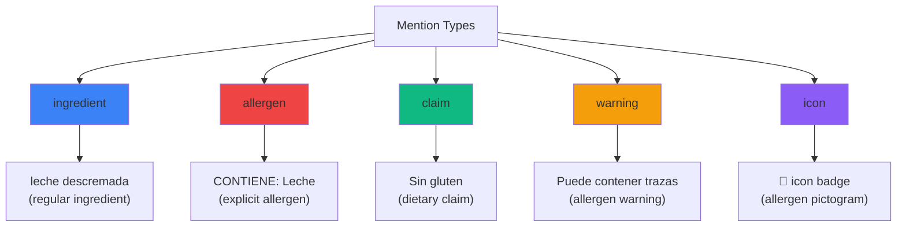
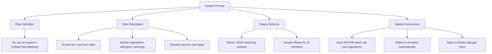
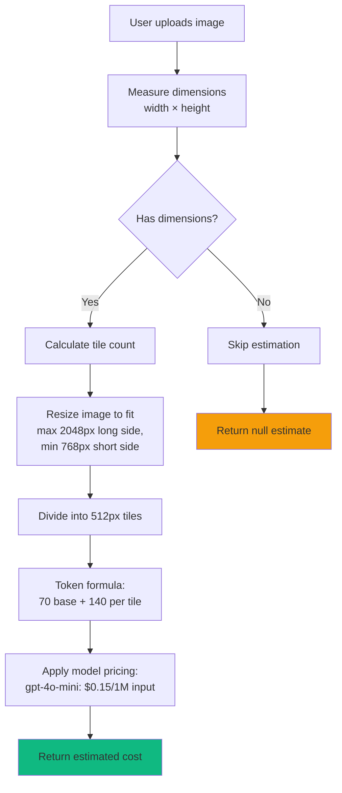
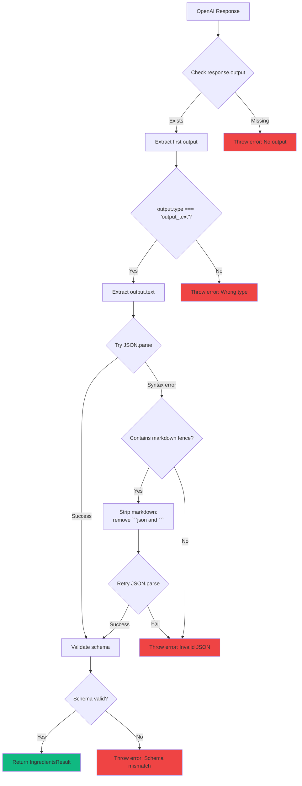

# OpenAI Integration

## Overview

AlergiasCL uses **OpenAI's Vision API** to extract structured ingredient data from product label photos. Unlike simple OCR, our integration uses a **mentions-based architecture** that provides:

- **Structured extraction:** Typed mentions with offsets, sections, and allergen implications
- **Explainability:** Each detected allergen links back to specific text spans
- **Quality assessment:** Legibility and confidence scores
- **Cost optimization:** Pre-flight estimation + intelligent caching

### Key Capabilities

✅ **Full label parsing** - Not just ingredients list, entire label (warnings, claims, icons)
✅ **E-number detection** - Automatic extraction of food additives
✅ **Allergen implication** - Links ingredients to allergen keys via synonyms
✅ **Section classification** - Distinguishes ingredients vs "puede contener" vs front-label
✅ **Character-level spans** - Precise offsets for UI highlighting

**Model Used:** `gpt-4o-mini` (default), configurable via `OPENAI_MODEL` env var

**Cost:** ~$0.001-0.003 per scan (depending on image size and model)

---

## Integration Architecture

```mermaid
sequenceDiagram
    participant Client as Scanner UI
    participant API as /api/analyze
    participant Vision as OpenAI Vision API
    participant Parser as Response Parser
    participant Validator as Schema Validator

    Client->>API: POST FormData(image, width, height)

    Note over API: 1. Convert to base64
    API->>API: Buffer.from(arrayBuffer).toString('base64')
    API->>API: Calculate pre-flight cost estimate

    Note over API: 2. Prepare request
    API->>API: Build JSON schema (strict mode)
    API->>API: Build system prompt (Chilean Spanish)

    Note over API: 3. Call Vision API
    API->>Vision: chat.completions.create({<br/>  model: "gpt-4o-mini",<br/>  messages: [system, user],<br/>  response_format: { json_schema }
<br/>})

    Vision-->>API: Response with usage stats

    Note over API: 4. Parse & validate
    API->>Parser: Extract output_text
    Parser->>Parser: JSON.parse(text)
    Parser->>Validator: Validate against schema
    Validator-->>Parser: ✓ Valid IngredientsResult

    Note over API: 5. Calculate actual cost
    API->>API: costFromUsage(tokens, model)

    API-->>Client: {<br/>  data: IngredientsResult,<br/>  tokensUSD: 0.0021,<br/>  usage: {...}<br/>}
```

---

## Mentions-Based Extraction

### What is a "Mention"?

A **mention** is a structured reference to a piece of text on the label with metadata about what it represents.

```typescript
interface Mention {
  surface: string;           // Original text as-is
  canonical: string;         // Normalized form (lowercase, no accents)
  type: MentionType;         // What kind of mention
  section: Section;          // Where on label
  offset: { start, end };    // Character span in ocr_text
  enumbers: string[];        // E-numbers in this mention
  implies_allergens: string[]; // Allergen keys implied
  evidence: string;          // Display snippet
}
```

### Mention Types



### Section Classification

| Section | Description | Example |
|---------|-------------|---------|
| `ingredients` | Main ingredient list | "INGREDIENTES: Leche, azúcar, ..." |
| `may_contain` | Trace warnings | "PUEDE CONTENER: Trazas de frutos secos" |
| `manufactured_in` | Cross-contamination risk | "Elaborado en instalación que procesa gluten" |
| `front_label` | Front-of-pack claims | "SIN LACTOSA", "VEGANO" |
| `allergen_warning` | Explicit allergen warnings | "CONTIENE: Soja y derivados" |
| `nutritional` | Nutrition facts table | "Carbohidratos: 15g" |
| `other` | Unclassified text | Brand name, product name |

### Offset System

Offsets are **character indices** into the `ocr_text` string:

```typescript
{
  "ocr_text": "INGREDIENTES: Leche descremada (65%), azúcar",
  "mentions": [
    {
      "surface": "Leche descremada",
      "offset": { "start": 14, "end": 31 }
      // ocr_text.substring(14, 31) === "Leche descremada"
    }
  ]
}
```

**Important:** `end` is **exclusive** (like Python slicing)

```javascript
// ✅ Correct
const text = ocr_text.substring(offset.start, offset.end);

// ❌ Wrong (includes extra character)
const text = ocr_text.substring(offset.start, offset.end + 1);
```

---

## System Prompt Engineering

### Prompt Structure

**Location:** `lib/openai/vision.ts:158-210`



### Prompt Breakdown

```markdown
You are an expert at analyzing Chilean food product labels.

**Your task:**
1. Perform OCR on the entire label image (not just the ingredients section)
2. Extract:
   - Full ingredient list
   - Allergen warnings ("CONTIENE:", "Puede contener", allergen icons)
   - Front-of-pack claims ("Sin gluten", "Vegano", etc.)
   - E-numbers (e.g., E322, E471)
3. For each mention, provide:
   - Type: ingredient | allergen | claim | warning | icon
   - Section: where on label it appears
   - Offset: character span in ocr_text
   - Allergen implications: which allergen keys it implies

**Chilean allergen keys:**
leche, huevos, pescado, mariscos, frutos_secos, mani, trigo, soja,
sesamo, apio, mostaza, lupino, moluscos, sulfitos, gluten

**Output quality:**
- legibility: "low" (blurry, tilted) | "medium" (readable) | "high" (clear)
- confidence: 0-1 score of extraction accuracy

**Important:**
- Scan the ENTIRE label, not just "INGREDIENTES:" section
- "Puede contener" warnings are type="warning", section="may_contain"
- E-numbers should be in uppercase (E322, not e322)
- canonical form: lowercase, no accents, underscores (e.g., "leche_descremada")
```

---

## JSON Schema (Strict Mode)

### Schema Definition

**Location:** `lib/openai/vision.ts:44-160`

```typescript
const schema = {
  type: "object",
  properties: {
    ocr_text: {
      type: "string",
      description: "Texto completo extraído del envase"
    },
    mentions: {
      type: "array",
      items: {
        type: "object",
        properties: {
          surface: { type: "string" },
          canonical: { type: "string" },
          type: {
            type: "string",
            enum: ["ingredient", "allergen", "claim", "warning", "icon"]
          },
          section: {
            type: "string",
            enum: ["ingredients", "may_contain", "manufactured_in",
                   "front_label", "allergen_warning", "nutritional", "other"]
          },
          offset: {
            type: "object",
            properties: {
              start: { type: "integer" },
              end: { type: "integer" }
            },
            required: ["start", "end"]
          },
          enumbers: {
            type: "array",
            items: { type: "string" }
          },
          implies_allergens: {
            type: "array",
            items: { type: "string" }
          },
          evidence: { type: "string" }
        },
        required: ["surface", "canonical", "type", "section", "offset",
                   "enumbers", "implies_allergens", "evidence"]
      }
    },
    detected_allergens: {
      type: "array",
      items: {
        type: "object",
        properties: {
          key: { type: "string" },
          source_mentions: { type: "array", items: { type: "integer" } },
          confidence: { type: "number" }
        },
        required: ["key", "source_mentions", "confidence"]
      }
    },
    quality: {
      type: "object",
      properties: {
        legibility: {
          type: "string",
          enum: ["low", "medium", "high"]
        },
        confidence: { type: "number" }
      },
      required: ["legibility", "confidence"]
    },
    source_language: { type: "string" },
    warnings: { type: "array", items: { type: "string" } }
  },
  required: ["ocr_text", "mentions", "detected_allergens", "quality",
             "source_language", "warnings"]
};
```

### Strict Mode Enforcement

```typescript
const response = await client.chat.completions.create({
  model,
  messages: [...],
  text: {
    format: {
      type: "json_schema",
      name: "ingredients_schema",
      schema,
      strict: true  // ← Enforces exact schema compliance
    }
  }
});
```

**Benefits of `strict: true`:**
- ✅ Guaranteed schema compliance (no missing fields)
- ✅ Type validation (enums, arrays, objects)
- ✅ Faster parsing (no need for defensive checks)
- ❌ Slightly higher cost (~5-10% token overhead)

---

## Cost Estimation

### Pre-Flight Estimation



### Token Calculation (Tile-Based)

**Algorithm:** Based on OpenAI's vision pricing rules

1. **Resize image:**
   - If any side > 2048px, scale down proportionally
   - If any side < 768px, scale up proportionally

2. **Divide into tiles:**
   - Each tile is 512×512 pixels
   - Round up partial tiles

3. **Calculate tokens:**
   ```
   tokens = 70 (base) + 140 × tile_count
   ```

4. **Apply pricing:**
   ```
   cost_usd = tokens × model_price_per_token
   ```

**Example:**

```typescript
// Image: 1200x800 pixels
// Fits within 2048x2048, no scaling needed

// Tiles:
width_tiles = ceil(1200 / 512) = 3
height_tiles = ceil(800 / 512) = 2
total_tiles = 3 × 2 = 6

// Tokens:
tokens = 70 + 140 × 6 = 910

// Cost (gpt-4o-mini: $0.15 / 1M input tokens):
cost = 910 × 0.00000015 = $0.0001365

// Add completion tokens (avg 400):
total_cost ≈ $0.0002
```

**Code Reference:** `lib/openai/cost-estimator.ts:estimateCost()`

---

## Post-Flight Cost Calculation

After API call completes, calculate actual cost from usage object:

```typescript
const response = await client.chat.completions.create({...});

const usage = response.usage;
// {
//   prompt_tokens: 1247,
//   completion_tokens: 423,
//   total_tokens: 1670
// }

const actualCost = costFromUsage({
  inputTokens: usage.prompt_tokens,
  outputTokens: usage.completion_tokens,
  model: "gpt-4o-mini"
});
// Returns: 0.0021 (USD)
```

**Code Reference:** `lib/openai/cost-estimator.ts:costFromUsage()`

---

## Quality Assessment

### Legibility Levels

| Level | Description | Example | Action |
|-------|-------------|---------|--------|
| **high** | Clear, well-lit, straight | Professional product photos | Proceed normally |
| **medium** | Readable but some issues | Slight blur, shadows | Show confidence warning |
| **low** | Blurry, tilted, poor lighting | Dark, motion blur | Prompt user to retake |

### Confidence Score

**Range:** 0.0 - 1.0

- **≥ 0.85**: High confidence, trust extraction
- **0.70 - 0.85**: Medium confidence, review questionable items
- **< 0.70**: Low confidence, warn user (based on `min_model_confidence`)

**Calculation:**
- OpenAI internal model confidence
- Adjusted for legibility (low legibility → lower confidence)

**Code Reference:** `lib/risk/evaluate.ts:185-195` (confidence threshold check)

---

## Response Parsing

### Parsing Flow



### Markdown Fence Handling

Sometimes OpenAI returns JSON wrapped in markdown code blocks:

```json
```json
{
  "ocr_text": "...",
  "mentions": [...]
}
```
```

**Solution:**

```typescript
// lib/openai/vision.ts:217-230
let textContent = outputContent.text;

// Strip markdown code fences if present
if (textContent.includes("```json")) {
  textContent = textContent
    .replace(/```json\s*/g, "")
    .replace(/```\s*/g, "")
    .trim();
}

const parsed = JSON.parse(textContent);
```

---

## Error Handling

### Common Errors

| Error | Cause | Solution |
|-------|-------|----------|
| `No output in response` | Empty OpenAI response | Retry with simpler image |
| `Unexpected output type` | Wrong response format | Check API version |
| `Invalid JSON` | Malformed response | Enable markdown stripping |
| `Schema validation failed` | Missing required fields | Check OpenAI schema definition |
| `Rate limit exceeded` | Too many requests | Implement exponential backoff |
| `Invalid image format` | Unsupported file type | Only allow JPEG, PNG, WebP |

### Error Recovery

```typescript
try {
  const result = await extractIngredientsViaSDK({...});
  return result;
} catch (error) {
  console.error("OpenAI Vision error:", error);

  if (error.message.includes("rate_limit")) {
    // Retry with exponential backoff
    await sleep(2000);
    return extractIngredientsViaSDK({...});
  }

  if (error.message.includes("Invalid JSON")) {
    // Log for debugging, return error to user
    throw new Error("No pudimos procesar la imagen. Intenta con mejor iluminación.");
  }

  throw error;
}
```

**Code Reference:** `app/api/analyze/route.ts:134-145`

---

## Optimization Strategies

### 1. Image Preprocessing (Client-Side)

```typescript
// components/ImagePicker.tsx
// Resize large images before upload
const maxDimension = 2048;
if (image.width > maxDimension || image.height > maxDimension) {
  const scale = maxDimension / Math.max(image.width, image.height);
  const canvas = document.createElement("canvas");
  canvas.width = image.width * scale;
  canvas.height = image.height * scale;
  ctx.drawImage(image, 0, 0, canvas.width, canvas.height);
  compressedBlob = await new Promise(resolve =>
    canvas.toBlob(resolve, "image/jpeg", 0.85)
  );
}
```

**Benefits:**
- Reduces upload time (smaller payload)
- Lowers OpenAI cost (fewer tiles)
- Maintains quality (2048px sufficient for OCR)

### 2. Caching (Server-Side)

See [CACHING_STRATEGY.md](./CACHING_STRATEGY.md) for details.

**Summary:**
- MD5 hash of image buffer
- 7-day TTL
- 90%+ expected hit rate
- $0 cost on cache hit

### 3. Model Selection

| Model | Cost | Quality | Speed | Use Case |
|-------|------|---------|-------|----------|
| `gpt-4o-mini` | $0.15/1M in | Good | Fast | Default (cost-effective) |
| `gpt-4o` | $2.50/1M in | Excellent | Medium | Premium (high accuracy) |

**Configuration:** Set `OPENAI_MODEL` env var

---

## Testing OpenAI Integration

### Manual Testing

```bash
# Test with real API key
export OPENAI_API_KEY=sk-...

# Start dev server
npm run dev

# Upload test image at http://localhost:3000/scan
```

### Test Images

**Good test cases:**
- ✅ Clear, well-lit label (legibility: high)
- ⚠️ Slightly blurry (legibility: medium)
- ❌ Very blurry or tilted (legibility: low)
- ✅ Contains E-numbers (test E-number extraction)
- ✅ Has "Puede contener" section (test warning detection)
- ✅ Front-of-pack claims (test section classification)

### Expected Behavior

1. **High legibility (≥ 0.85 confidence):**
   - All ingredients extracted
   - E-numbers detected
   - Warnings correctly classified
   - Offsets accurate (can highlight in UI)

2. **Medium legibility (0.70-0.85 confidence):**
   - Most ingredients extracted
   - Some minor OCR errors acceptable
   - Show "Pedir verificación" action

3. **Low legibility (< 0.70 confidence):**
   - Risk engine flags as "low_confidence"
   - UI shows warning + retake prompt

---

## Monitoring & Metrics

### Key Metrics to Track

- **Average cost per scan:** Target: $0.001-0.003
- **Cache hit rate:** Target: 90%+
- **Average confidence:** Target: ≥ 0.80
- **Legibility distribution:** High: 70%, Medium: 25%, Low: 5%
- **API latency:** P50: 2s, P95: 4s
- **Error rate:** Target: < 1%

### Cost Breakdown Example

```
Monthly usage: 10,000 scans
Cache hit rate: 90%

Fresh scans: 10,000 × 10% = 1,000
Cached scans: 10,000 × 90% = 9,000

Cost calculation:
- Fresh: 1,000 × $0.002 = $2.00
- Cached: 9,000 × $0.00 = $0.00

Total monthly cost: $2.00
```

---

## Future Enhancements

### Planned Improvements

1. **Batch processing** - Process multiple labels in one request
2. **GPT-4o upgrade** - Higher accuracy for complex labels
3. **Custom fine-tuning** - Train on Chilean label dataset
4. **Synonym expansion** - Pre-process image with known E-number synonyms
5. **Confidence calibration** - Adjust thresholds based on real-world accuracy

### Research Areas

- **Vision + text hybrid** - Pre-OCR with Tesseract, then Vision for structured extraction
- **Multi-modal embeddings** - Search similar products by label image
- **Barcode integration** - Combine barcode lookup with Vision API

---

## Related Documentation

- [TYPE_SYSTEM.md](./TYPE_SYSTEM.md) - IngredientsResult type definition
- [RISK_ENGINE.md](./RISK_ENGINE.md) - How mentions are used in risk evaluation
- [CACHING_STRATEGY.md](./CACHING_STRATEGY.md) - Cost optimization via caching
- [API_CONTRACTS.md](./API_CONTRACTS.md) - /api/analyze endpoint specification

---

## Code References

- **Main integration:** `lib/openai/vision.ts:extractIngredientsViaSDK()`
- **Schema definition:** `lib/openai/vision.ts:44-160`
- **Cost estimation:** `lib/openai/cost-estimator.ts`
- **Type definitions:** `lib/openai/vision-types.ts`
- **API endpoint:** `app/api/analyze/route.ts:134-145`

---

## Troubleshooting

### "No output in response"

**Cause:** OpenAI returned empty response

**Solution:**
1. Check image is valid JPEG/PNG
2. Ensure image is not too large (< 20MB)
3. Verify API key is valid
4. Check OpenAI status page

### "Unexpected output type"

**Cause:** Response format changed

**Solution:**
1. Check OpenAI API version
2. Verify `response_format` parameter
3. Update type definitions if API changed

### Low confidence scores

**Cause:** Poor image quality

**Solution:**
1. Prompt user to retake with better lighting
2. Use flash in low light
3. Hold camera steady (avoid motion blur)
4. Frame label directly (minimize angle)

### High costs

**Cause:** Too many fresh scans, cache not working

**Solution:**
1. Check cache hit rate in logs
2. Verify MD5 hash calculation
3. Ensure TTL is set correctly (7 days)
4. Consider switching to `gpt-4o-mini`
