# Profile System

## Overview

The **Profile System** is how AlergiasCL personalizes risk assessment for each user. It combines:

1. **User allergens** - What you're allergic to + severity
2. **Diets** - Dietary restrictions (vegan, celiac, etc.)
3. **Intolerances** - Non-allergic reactions (lactose, FODMAP)
4. **Strictness profiles** - How cautious to be (Diario, Pediátrico, Anaphylaxis)
5. **Per-allergen overrides** - Custom settings for specific allergens

### Key Capabilities

✅ **Multi-layered configuration** - Global + per-allergen customization
✅ **Severity-based decisions** - 0-3 scale (mild → anaphylaxis)
✅ **Strictness inheritance** - Base settings + overrides = effective settings
✅ **Single RPC fetch** - All profile data in one call (`get_profile_payload`)
✅ **Flexible customization** - Users control their own risk tolerance

**Database Tables:**
- `user_profiles` (base profile)
- `strictness_profiles` (named modes)
- `strictness_overrides` (per-allergen custom settings)
- `user_profile_allergens` (many-to-many with severity)
- `user_profile_diets` (many-to-many)
- `user_profile_intolerances` (many-to-many with severity)

---

## Profile Architecture


---

## Strictness Profiles

### Predefined Modes

| Mode | block_traces | block_same_line | e_numbers_uncertain | min_confidence | anaphylaxis_mode | Use Case |
|------|-------------|-----------------|---------------------|----------------|------------------|----------|
| **Diario** | ❌ false | ❌ false | ⚠️ warn | 0.70 | ❌ false | Everyday use, moderate caution |
| **Pediátrico** | ✅ true | ✅ true | 🚫 block | 0.80 | ❌ false | Children, extra caution |
| **Anaphylaxis** | ✅ true | ✅ true | 🚫 block | 0.85 | ✅ true | Life-threatening allergies |

### Strictness Fields Explained

```typescript
interface StrictnessProfile {
  id: string;
  name: string;

  /**
   * Block products with "Puede contener" warnings
   * Example: "Puede contener trazas de soja"
   */
  block_traces: boolean;

  /**
   * Block products manufactured on same line as allergens
   * Example: "Elaborado en instalación que procesa frutos secos"
   */
  block_same_line: boolean;

  /**
   * How to handle E-numbers with uncertain allergen origins
   * - "allow": Proceed (warn only if linked allergen)
   * - "warn": Show warning
   * - "block": Block all uncertain E-numbers
   */
  e_numbers_uncertain: "allow" | "warn" | "block";

  /**
   * Minimum model confidence threshold (0-1)
   * Below this, risk engine flags as "low_confidence"
   * Typical: 0.70 (70%)
   */
  min_model_confidence: number;

  /**
   * Pediatric mode: extra caution for children
   * - Escalates MEDIUM → HIGH
   * - Lowers confidence threshold
   */
  pediatric_mode: boolean;

  /**
   * Anaphylaxis mode: maximum strictness
   * - Forces ALL allergen matches to HIGH
   * - Ignores severity (even severity 0 → HIGH)
   */
  anaphylaxis_mode: boolean;

  /**
   * Default PPM threshold for residual proteins
   * Lower = stricter (e.g., 5 ppm vs 20 ppm)
   */
  residual_protein_ppm_default: number;
}
```

---

## Per-Allergen Overrides

### Why Overrides?

Users may want **different strictness for different allergens**:

**Example:**
- User has **milk allergy (severe, anaphylaxis)** + **soy allergy (mild)**
- Wants to:
  - **Block all traces for milk** (very strict)
  - **Allow traces for soy** (more relaxed)

**Solution:** Use base "Diario" strictness + override for "leche"

### Override Structure

```typescript
interface StrictnessOverride {
  allergen_key: string;        // Which allergen this applies to
  block_traces?: boolean;      // Override base setting
  block_same_line?: boolean;   // Override base setting
  e_numbers_uncertain?: "allow" | "warn" | "block";
  residual_protein_ppm?: number;  // Override base PPM
  notes?: string;              // User notes
}
```

### Inheritance Diagram


---

## get_profile_payload RPC

### Single-Call Profile Fetch

Instead of multiple queries, use `get_profile_payload` RPC to fetch everything in one call:

```sql
-- RPC function signature
get_profile_payload(p_user_id UUID) RETURNS json
```

### Returned Structure

```typescript
interface ProfilePayload {
  user_id: string;

  profile: {
    display_name: string | null;
    notes: string | null;
    pregnant: boolean;
    created_at: string;
    updated_at: string;
  } | null;

  diets: string[];  // ["vegan", "celiac"]

  allergens: Array<{
    key: string;      // "leche"
    severity: number; // 0-3
  }>;

  intolerances: Array<{
    key: string;      // "lactosa"
    severity: number; // 0-3
  }>;

  strictness: StrictnessProfile | null;

  overrides: Record<string, StrictnessOverride>;
  // Example: { "leche": { block_traces: true, residual_protein_ppm: 5 } }
}
```

### Usage

**Backend (server-side):**

```typescript
import { fetchUserProfile } from "@/lib/supabase/queries/profile";

const profile = await fetchUserProfile(supabase, userId);

// Now you have complete profile in one object
console.log(profile.allergens);  // [{ key: "leche", severity: 3 }, ...]
console.log(profile.strictness); // { name: "Anaphylaxis", block_traces: true, ... }
console.log(profile.overrides);  // { "leche": { block_traces: true, ... } }
```

**Code Reference:** `lib/supabase/queries/profile.ts:fetchUserProfile()`

---

## Effective Strictness Calculation

### Merging Logic


### Implementation

**Code Reference:** `lib/risk/evaluate.ts:20-50`

```typescript
function getEffectiveStrictness(
  allergenKey: string,
  profile: ProfilePayload
): EffectiveStrictness {
  const base = profile.strictness;
  const override = profile.overrides[allergenKey];

  // No override, return base
  if (!override) {
    return {
      block_traces: base.block_traces,
      block_same_line: base.block_same_line,
      e_numbers_uncertain: base.e_numbers_uncertain,
      residual_protein_ppm: base.residual_protein_ppm_default
    };
  }

  // Merge: override takes precedence, fallback to base
  return {
    block_traces: override.block_traces ?? base.block_traces,
    block_same_line: override.block_same_line ?? base.block_same_line,
    e_numbers_uncertain: override.e_numbers_uncertain ?? base.e_numbers_uncertain,
    residual_protein_ppm: override.residual_protein_ppm ?? base.residual_protein_ppm_default
  };
}
```

---

## Severity Levels

### Severity Scale (0-3)

```mermaid
flowchart LR
    A[Severity 0<br/>Mild] --> B[🟢 Low Priority]
    C[Severity 1<br/>Moderate] --> D[🟡 Medium Priority]
    E[Severity 2<br/>Severe] --> F[🟠 High Priority]
    G[Severity 3<br/>Anaphylaxis] --> H[🔴 Critical Priority]

    B --> I[Allow traces<br/>unless strict mode]
    D --> J[Warn on traces]
    F --> K[Block product]
    H --> L[Block product +<br/>force HIGH risk]

    style B fill:#10b981
    style D fill:#fbbf24
    style F fill:#f97316
    style H fill:#ef4444
```



### Severity Impact

| Severity | Description | Risk Escalation | Example |
|----------|-------------|-----------------|---------|
| **0** | Mild discomfort | Low (allow unless strict) | Minor skin irritation |
| **1** | Moderate reaction | Medium (warn) | Stomach upset, hives |
| **2** | Severe reaction | High (block) | Difficulty breathing, swelling |
| **3** | Anaphylaxis | **Always HIGH** | Life-threatening, requires EpiPen |

**Code Reference:** `lib/risk/evaluate.ts:185-210`

```typescript
// Severity-based risk escalation
if (allergen.severity >= 3) {
  return {
    level: "high",
    decision: "block",
    reason: "allergen.anaphylaxis"
  };
}

if (allergen.severity >= 2) {
  return {
    level: "high",
    decision: "block",
    reason: "allergen.severe"
  };
}
```

---

## User Profile Management

### Profile Creation Flow

```mermaid
sequenceDiagram
    participant User
    participant Frontend as Profile Editor
    participant API as Supabase API
    participant DB as PostgreSQL

    User->>Frontend: Sign up / first login
    Frontend->>API: auth.signUp(email, password)
    API->>DB: INSERT INTO auth.users

    Note over DB: Trigger: ensure_default_strictness

    DB->>DB: Find "Diario" strictness
    DB->>DB: INSERT INTO user_profiles<br/>(active_strictness_id = Diario)

    DB-->>API: user_id + profile created
    API-->>Frontend: Session established

    User->>Frontend: Complete onboarding wizard
    Frontend->>API: Add allergens, diets, intolerances
    API->>DB: INSERT INTO user_profile_allergens
    API->>DB: INSERT INTO user_profile_diets

    User->>Frontend: Customize strictness
    Frontend->>API: Switch to "Pediátrico"
    API->>DB: UPDATE user_profiles<br/>SET active_strictness_id = Pediátrico

    User->>Frontend: Add override for "leche"
    Frontend->>API: Create override (block_traces = true)
    API->>DB: INSERT INTO strictness_overrides

    DB-->>API: Profile complete
    API-->>Frontend: Success
    Frontend-->>User: Profile ready!
```



### Default Strictness Trigger

**SQL Trigger:** `ensure_default_strictness` (runs on user creation)

```sql
-- Automatically assigns "Diario" strictness to new users
CREATE OR REPLACE FUNCTION ensure_default_strictness()
RETURNS TRIGGER AS $$
DECLARE
  default_strictness_id UUID;
BEGIN
  -- Find "Diario" strictness profile
  SELECT id INTO default_strictness_id
  FROM strictness_profiles
  WHERE name = 'Diario'
  LIMIT 1;

  -- Update new user profile
  NEW.active_strictness_id := default_strictness_id;

  RETURN NEW;
END;
$$ LANGUAGE plpgsql;
```

---

## Allergen, Diet, Intolerance Management

### Adding Allergens

**Frontend:** `/profile/edit`

```typescript
const allergens = [
  { key: "leche", severity: 3, notes: "Anaphylaxis risk, carry EpiPen" },
  { key: "soja", severity: 1, notes: "Mild hives" }
];

// Insert via Supabase
await supabase
  .from("user_profile_allergens")
  .insert(allergens.map(a => ({
    user_id: user.id,
    allergen_key: a.key,
    severity: a.severity,
    notes: a.notes
  })));
```

### Adding Diets

**Frontend:** `/profile/edit`

```typescript
const diets = ["vegan", "celiac"];

// Insert via Supabase
await supabase
  .from("user_profile_diets")
  .insert(diets.map(d => ({
    user_id: user.id,
    diet_key: d
  })));
```

### Adding Intolerances

**Frontend:** `/profile/edit`

```typescript
const intolerances = [
  { key: "lactosa", severity: 2 },
  { key: "fodmap", severity: 1 }
];

// Insert via Supabase
await supabase
  .from("user_profile_intolerances")
  .insert(intolerances.map(i => ({
    user_id: user.id,
    intolerance_key: i.key,
    severity: i.severity
  })));
```

---

## Strictness Customization UI

### Switching Modes

**Frontend:** `/profile/strictness`

```typescript
const modes = ["Diario", "Pediátrico", "Anaphylaxis"];

// Update active strictness
async function switchMode(modeName: string) {
  // Find strictness ID by name
  const { data: strictness } = await supabase
    .from("strictness_profiles")
    .select("id")
    .eq("name", modeName)
    .single();

  // Update user profile
  await supabase
    .from("user_profiles")
    .update({ active_strictness_id: strictness.id })
    .eq("user_id", user.id);
}
```

### Per-Allergen Overrides

**Frontend:** `/profile/strictness/[allergenKey]`

```typescript
// Example: Override for "leche"
const override = {
  allergen_key: "leche",
  block_traces: true,
  block_same_line: true,
  e_numbers_uncertain: "block",
  residual_protein_ppm: 5,
  notes: "Extreme sensitivity, history of anaphylaxis"
};

// Insert override (linked to active strictness)
await supabase
  .from("strictness_overrides")
  .insert({
    strictness_id: user.profile.active_strictness_id,
    ...override
  });
```

---

## Example Profiles

### Example 1: Everyday User (Moderate Caution)

```json
{
  "user_id": "user-123",
  "profile": {
    "display_name": "Juan Pérez",
    "pregnant": false
  },
  "allergens": [
    { "key": "mani", "severity": 2 }
  ],
  "diets": [],
  "intolerances": [],
  "strictness": {
    "name": "Diario",
    "block_traces": false,
    "block_same_line": false,
    "e_numbers_uncertain": "warn",
    "min_model_confidence": 0.70,
    "pediatric_mode": false,
    "anaphylaxis_mode": false,
    "residual_protein_ppm_default": 20
  },
  "overrides": {}
}
```

**Behavior:**
- ✅ Allows "Puede contener trazas de maní" (trace warnings OK)
- ⚠️ Warns on uncertain E-numbers
- 🚫 Blocks direct maní ingredients (severity 2)

### Example 2: Pediatric User (Extra Caution)

```json
{
  "user_id": "user-456",
  "profile": {
    "display_name": "Sofía (4 años)",
    "pregnant": false
  },
  "allergens": [
    { "key": "huevo", "severity": 2 },
    { "key": "leche", "severity": 1 }
  ],
  "diets": [],
  "intolerances": [],
  "strictness": {
    "name": "Pediátrico",
    "block_traces": true,
    "block_same_line": true,
    "e_numbers_uncertain": "block",
    "min_model_confidence": 0.80,
    "pediatric_mode": true,
    "anaphylaxis_mode": false,
    "residual_protein_ppm_default": 10
  },
  "overrides": {}
}
```

**Behavior:**
- 🚫 Blocks "Puede contener huevo" (no trace warnings)
- 🚫 Blocks same-line manufacturing
- 🚫 Blocks uncertain E-numbers
- 📈 Higher confidence threshold (80% vs 70%)

### Example 3: Anaphylaxis User (Maximum Strictness)

```json
{
  "user_id": "user-789",
  "profile": {
    "display_name": "María González",
    "pregnant": false
  },
  "allergens": [
    { "key": "leche", "severity": 3 },
    { "key": "frutos_secos", "severity": 3 }
  ],
  "diets": [],
  "intolerances": [],
  "strictness": {
    "name": "Anaphylaxis",
    "block_traces": true,
    "block_same_line": true,
    "e_numbers_uncertain": "block",
    "min_model_confidence": 0.85,
    "pediatric_mode": false,
    "anaphylaxis_mode": true,
    "residual_protein_ppm_default": 5
  },
  "overrides": {
    "leche": {
      "residual_protein_ppm": 2,
      "notes": "Extreme sensitivity, carry EpiPen"
    }
  }
}
```

**Behavior:**
- 🚨 **Forces ALL allergen matches to HIGH** (even if severity was lower)
- 🚫 Blocks all traces, same-line, uncertain E-numbers
- 📈 Strictest PPM threshold (2 ppm for leche, 5 ppm default)
- 🔴 Zero tolerance policy

---

## RLS (Row Level Security)

All profile data is protected by Row Level Security:

```sql
-- Users can only read their own profile
CREATE POLICY "Users can read own profile"
ON user_profiles FOR SELECT
USING (auth.uid() = user_id);

-- Users can only update their own profile
CREATE POLICY "Users can update own profile"
ON user_profiles FOR UPDATE
USING (auth.uid() = user_id);

-- Users can only read their own allergens
CREATE POLICY "Users can read own allergens"
ON user_profile_allergens FOR SELECT
USING (auth.uid() = user_id);
```

**Security:** No user can access another user's profile data.

---

## Testing Profile System

### Unit Tests

```typescript
describe("getEffectiveStrictness", () => {
  it("should use base settings when no override exists", () => {
    const profile: ProfilePayload = {
      strictness: {
        name: "Diario",
        block_traces: false,
        residual_protein_ppm_default: 20
      },
      overrides: {}
    };

    const effective = getEffectiveStrictness("leche", profile);

    expect(effective.block_traces).toBe(false);
    expect(effective.residual_protein_ppm).toBe(20);
  });

  it("should merge override with base", () => {
    const profile: ProfilePayload = {
      strictness: {
        name: "Diario",
        block_traces: false,
        residual_protein_ppm_default: 20
      },
      overrides: {
        "leche": {
          block_traces: true,
          residual_protein_ppm: 5
        }
      }
    };

    const effective = getEffectiveStrictness("leche", profile);

    expect(effective.block_traces).toBe(true);  // From override
    expect(effective.residual_protein_ppm).toBe(5);  // From override
  });
});
```

### Integration Tests

```bash
# Test profile fetch RPC
npm run test:rpc -- get_profile_payload

# Test strictness switching
npm run test:integration -- switch-strictness

# Test override creation
npm run test:integration -- create-override
```

---

## Troubleshooting

### Issue: User profile not found

**Cause:** User signed up but `ensure_default_strictness` trigger didn't run

**Solution:**
1. Check trigger exists in Supabase dashboard
2. Manually insert default profile:
   ```sql
   INSERT INTO user_profiles (user_id, active_strictness_id)
   VALUES (
     'user-uuid',
     (SELECT id FROM strictness_profiles WHERE name = 'Diario' LIMIT 1)
   );
   ```

### Issue: Overrides not applying

**Cause:** Override not linked to correct `strictness_id`

**Solution:**
1. Verify override exists:
   ```sql
   SELECT * FROM strictness_overrides
   WHERE strictness_id = (
     SELECT active_strictness_id FROM user_profiles WHERE user_id = 'user-uuid'
   );
   ```
2. Check `allergen_key` matches exactly (case-sensitive)

### Issue: RPC returns null

**Cause:** RLS policy blocking query

**Solution:**
1. Ensure request is authenticated (has valid session)
2. Check RLS policies allow read access
3. Use service role client for debugging (bypasses RLS)

---

## Related Documentation

- [RISK_ENGINE.md](./RISK_ENGINE.md) - How strictness affects risk evaluation
- [TYPE_SYSTEM.md](./TYPE_SYSTEM.md) - ProfilePayload type definition
- [DATA_MODEL.md](./DATA_MODEL.md) - Complete database schema

---

## Code References

- **Profile fetch:** `lib/supabase/queries/profile.ts:fetchUserProfile()` (85 lines)
- **RPC function:** Supabase SQL: `get_profile_payload`
- **Strictness merging:** `lib/risk/evaluate.ts:20-50`
- **Profile UI:** `app/profile/edit/page.tsx`, `app/profile/strictness/page.tsx`

---

## Future Enhancements

1. **Multi-profile support** - Manage family members (kids with different allergens)
2. **Profile templates** - Pre-configured profiles for common allergy combinations
3. **Strictness scheduling** - Different strictness for different times (e.g., stricter when pregnant)
4. **AI-suggested strictness** - Recommend strictness based on allergen severity distribution
5. **Profile import/export** - JSON export for sharing/backup
