# Risk Evaluation Engine

## Overview

The **Risk Engine** is the core intelligence of AlergiasCL. It combines OpenAI's structured ingredient extraction with user-specific profiles to produce **explainable, evidence-based risk assessments**.

### Key Capabilities

✅ **Multi-factor evaluation** - Allergens, diets, intolerances, E-numbers, confidence
✅ **Severity-based escalation** - Anaphylaxis risk automatically triggers HIGH
✅ **Strictness customization** - Global + per-allergen settings
✅ **Evidence tracking** - Every decision links back to specific text spans
✅ **Explainable AI** - Users see exactly why a product is flagged

**Code Location:** `lib/risk/evaluate.ts` (466 lines)

**Input:** `IngredientsResult` + `ProfilePayload` + `ENumberPolicy[]`

**Output:** `RiskAssessment` (level, decision, reasons, matched items, actions)

---

## Decision Tree

```mermaid
flowchart TD
    A[Start: evaluateRisk] --> B[Input:<br/>IngredientsResult<br/>ProfilePayload<br/>ENumberPolicy[]]

    B --> C[Step 1: Match Allergens<br/>from mentions & detected_allergens]

    C --> D{Found allergen<br/>matches?}

    D -->|Yes| E[Check allergen severity<br/>0-3 scale]
    D -->|No| F[Step 2: Check Diets<br/>DIET_BLOCKS rules]

    E --> G{Severity ≥ 3<br/>anaphylaxis?}

    G -->|Yes| H[🚨 ESCALATE to HIGH<br/>reason: allergen_anaphylaxis]
    G -->|No| I{Severity ≥ 2<br/>severe?}

    I -->|Yes| J[🟠 Base risk: HIGH<br/>reason: allergen_severe]
    I -->|No| K{Via = 'may_contain'<br/>traces?}

    K -->|Yes| L{Strictness:<br/>block_traces?}
    K -->|No| M{Via = 'explicit'?}

    L -->|Yes| H
    L -->|No| N[🟡 Base risk: MEDIUM<br/>reason: allergen_trace]

    M -->|Yes| O[🔴 Base risk: HIGH<br/>reason: allergen_inline]
    M -->|No| F

    F --> P{Found diet<br/>violations?}

    P -->|Yes| Q[🔴 Base risk: HIGH<br/>reason: diet_block]
    P -->|No| R[Step 3: Check Intolerances<br/>INTOLERANCE_TRIGGERS]

    R --> S{Found intolerance<br/>triggers?}

    S -->|Yes| T{Severity ≥ 2?}
    S -->|No| U[Step 4: Evaluate E-numbers]

    T -->|Yes| V[🟠 Base risk: HIGH<br/>reason: intolerance_severe]
    T -->|No| W[🟡 Base risk: MEDIUM<br/>reason: intolerance_mild]

    U --> X{E-number<br/>policy = 'block'?}

    X -->|Yes| Y[🔴 Base risk: HIGH<br/>reason: enumber_block]
    X -->|No| Z{E-number<br/>policy = 'warn'?}

    Z -->|Yes| AA[🟡 Base risk: MEDIUM<br/>reason: enumber_warn]
    Z -->|No| AB[Step 5: Check Confidence<br/>quality.confidence]

    AB --> AC{Confidence <<br/>min_model_confidence?}

    AC -->|Yes| AD[🟡 Base risk: MEDIUM<br/>reason: low_confidence]
    AC -->|No| AE[✅ Base risk: LOW<br/>allow]

    H --> AF[Step 6: Apply Strictness<br/>check overrides]
    J --> AF
    N --> AF
    O --> AF
    Q --> AF
    V --> AF
    W --> AF
    Y --> AF
    AA --> AF
    AD --> AF
    AE --> AF

    AF --> AG{anaphylaxis_mode<br/>= true?}

    AG -->|Yes| AH[🚨 FORCE HIGH<br/>all matches → HIGH]
    AG -->|No| AI[Step 7: Aggregate Evidence<br/>collect RiskReasons]

    AH --> AI

    AI --> AJ{Determine final<br/>risk level}

    AJ --> AK[LOW: allow]
    AJ --> AL[MEDIUM: warn]
    AJ --> AM[HIGH: block]

    AK --> AN[Return RiskAssessment]
    AL --> AN
    AM --> AN

    style H fill:#ef4444
    style J fill:#f97316
    style O fill:#dc2626
    style Q fill:#dc2626
    style V fill:#f97316
    style Y fill:#dc2626
    style N fill:#fbbf24
    style AA fill:#fbbf24
    style W fill:#fbbf24
    style AD fill:#fbbf24
    style AE fill:#10b981
    style AK fill:#10b981
    style AL fill:#fbbf24
    style AM fill:#ef4444
```

---

## Risk Levels & Decisions

### Risk Levels

| Level | Meaning | UI Color | Emoji | Actions |
|-------|---------|----------|-------|---------|
| **LOW** | No allergen matches, high confidence | Green | ✅ | Guardar |
| **MEDIUM** | Trace warnings, low confidence, intolerances | Yellow | ⚠️ | Guardar + Pedir verificación |
| **HIGH** | Direct allergen match, severity ≥2, anaphylaxis | Red | 🚫 | Ver alternativas + Pedir verificación |

### Risk Decisions

| Decision | Meaning | User Action |
|----------|---------|-------------|
| **allow** | Safe to consume | Proceed with purchase |
| **warn** | Proceed with caution | Review warnings carefully |
| **block** | Do NOT consume | Avoid this product |

**Mapping:**
- `LOW` → `allow`
- `MEDIUM` → `warn`
- `HIGH` → `block`

---

## Reason Types

```typescript
export type RiskReasonKind =
  | "allergen"          // Allergen match from profile
  | "diet"              // Diet restriction (celiac, vegan, etc)
  | "intolerance"       // Intolerance trigger (FODMAP, lactose)
  | "enumber"           // E-number policy
  | "residual_protein"  // Residual protein concern
  | "low_confidence";   // Model confidence below threshold
```

### Reason Structure

```typescript
interface RiskReason {
  kind: RiskReasonKind;
  via?: AllergenVia;           // For allergen reasons
  mentionIds: number[];         // References to Mention indices
  allergenKey?: string;         // Which allergen triggered
  rule: string;                 // Which rule triggered
  confidence: number;           // Confidence of this reason (0-1)
  evidence: string;             // Human-readable evidence
  // E-number specific
  eNumberCode?: string;
  linkedAllergens?: string[];
  // Diet/intolerance specific
  dietKey?: string;
  intoleranceKey?: string;
}
```

### AllergenVia (How Allergen Was Detected)

```mermaid
graph LR
    A[AllergenVia] --> B[explicit<br/>Direct ingredient]
    A --> C[may_contain<br/>Puede contener]
    A --> D[icon<br/>Allergen badge]
    A --> E[derived<br/>E-number origin]

    B --> F["INGREDIENTES: Leche"]
    C --> G["PUEDE CONTENER: Trazas de soja"]
    D --> H["🥛 icon on package"]
    E --> I["E322 (lecitina de soja)"]

    style B fill:#dc2626
    style C fill:#fbbf24
    style D fill:#f97316
    style E fill:#8b5cf6
```



---

## Risk Escalation Rules

### Comprehensive Escalation Table

| Condition | Base Risk | Escalated Risk | Reason Code | Notes |
|-----------|-----------|----------------|-------------|-------|
| **Severity ≥ 3** (anaphylaxis) | any | **HIGH** | `allergen.anaphylaxis` | Life-threatening |
| **Severity ≥ 2** (severe) | any | **HIGH** | `allergen.severe` | Serious reaction |
| **anaphylaxis_mode = true** | any match | **HIGH** | `strictness.anaphylaxis_mode` | Ultra-strict mode |
| **pediatric_mode = true** + match | MEDIUM | **HIGH** | `strictness.pediatric_mode` | Extra caution for children |
| **block_traces = true** + "Puede contener" | MEDIUM | **HIGH** | `allergen.trace.block` | Strictness override |
| **block_same_line = true** + "Misma línea" | MEDIUM | **HIGH** | `allergen.same_line.block` | Cross-contamination risk |
| **E-number policy = "block"** | LOW/MEDIUM | **HIGH** | `enumber.policy.block` | Policy violation |
| **E-number policy = "warn"** | LOW | **MEDIUM** | `enumber.policy.warn` | Uncertain origin |
| **confidence < min_model_confidence** | LOW | **MEDIUM** | `quality.low_confidence` | Below threshold |
| **Diet violation** (e.g., vegan + meat) | any | **HIGH** | `diet.block` | Dietary restriction |
| **Intolerance severity ≥ 2** | any | **HIGH** | `intolerance.severe` | Strong reaction |
| **Intolerance severity < 2** | any | **MEDIUM** | `intolerance.mild` | Mild discomfort |

### Escalation Priority

```
1. anaphylaxis_mode = true → FORCE HIGH (overrides all)
2. Severity ≥ 3 → HIGH
3. Strictness overrides (block_traces, block_same_line) → HIGH
4. E-number policy = "block" → HIGH
5. Diet violations → HIGH
6. Severity ≥ 2 → HIGH
7. Confidence threshold → MEDIUM
8. Default: LOW
```

---

## Evidence Tracking

### MentionIds Linking

Every `RiskReason` includes `mentionIds` that reference the specific `Mention` objects from `IngredientsResult`:

```typescript
// Example: User is allergic to "leche"
const reasons: RiskReason[] = [
  {
    kind: "allergen",
    via: "explicit",
    mentionIds: [0, 2],  // ← Indices into analysis.mentions[]
    allergenKey: "leche",
    rule: "allergen.inline.block",
    confidence: 0.95,
    evidence: "Contiene leche descremada (65%) y crema (leche)"
  }
];

// Retrieve actual mentions:
const relatedMentions = mentionIds.map(id => analysis.mentions[id]);
// [
//   { surface: "Leche descremada", offset: {start: 14, end: 31}, ... },
//   { surface: "crema (leche)", offset: {start: 47, end: 60}, ... }
// ]
```

**Why this matters:**
- **UI highlighting:** Use offsets to highlight allergens in OCR text
- **Explainability:** Show user exact text that triggered warning
- **Traceability:** Audit trail for debugging

### Confidence Aggregation

Each reason has a confidence score:

```typescript
// Example: Multiple mentions with different confidences
const reason = {
  kind: "allergen",
  mentionIds: [0, 2, 5],
  confidence: Math.max(
    analysis.mentions[0].confidence,  // 0.95
    analysis.mentions[2].confidence,  // 0.92
    analysis.mentions[5].confidence   // 0.88
  )  // = 0.95 (highest confidence)
};
```

**Overall assessment confidence:**

```typescript
// RiskAssessment.confidence
risk.confidence = Math.min(
  analysis.quality.confidence,  // Model confidence
  ...reasons.map(r => r.confidence)  // Min of all reason confidences
);
```

---

## Strictness Application

### Base Strictness Profile

```typescript
interface StrictnessProfile {
  name: string;                    // "Diario", "Pediátrico", "Anaphylaxis"
  block_traces: boolean;           // Block "Puede contener"
  block_same_line: boolean;        // Block "Misma línea"
  e_numbers_uncertain: "allow" | "warn" | "block";
  min_model_confidence: number;    // 0-1
  pediatric_mode: boolean;
  anaphylaxis_mode: boolean;
  residual_protein_ppm_default: number;
}
```

### Per-Allergen Overrides

```typescript
// Example: User has "Diario" strictness (block_traces = false)
// BUT wants to block traces for "leche" specifically
const overrides = {
  "leche": {
    block_traces: true,           // ← Overrides base setting
    residual_protein_ppm: 2,      // ← Stricter than default 20ppm
    notes: "Extreme sensitivity"
  }
};
```

### Effective Strictness Calculation


**Code Reference:** `lib/risk/evaluate.ts:20-50`

```typescript
function getEffectiveStrictness(
  allergenKey: string,
  profile: ProfilePayload
): EffectiveStrictness {
  const base = profile.strictness;
  const override = profile.overrides[allergenKey];

  if (!override) return base;

  // Merge override with base (override takes precedence)
  return {
    ...base,
    block_traces: override.block_traces ?? base.block_traces,
    block_same_line: override.block_same_line ?? base.block_same_line,
    e_numbers_uncertain: override.e_numbers_uncertain ?? base.e_numbers_uncertain,
    residual_protein_ppm: override.residual_protein_ppm ?? base.residual_protein_ppm_default
  };
}
```

---

## Matched Items

The `RiskAssessment.matched` object groups all detected items by category:

### MatchedAllergen

```typescript
interface MatchedAllergen {
  key: string;              // "leche"
  decision: RiskDecision;   // "block"
  confidence: number;       // 0.95
  severity: number;         // 3 (from profile)
  via: AllergenVia[];       // ["explicit", "derived"]
  mentionIds: number[];     // [0, 2, 7]
}
```

**Example:**

```json
{
  "key": "leche",
  "decision": "block",
  "confidence": 0.95,
  "severity": 3,
  "via": ["explicit", "derived"],
  "mentionIds": [0, 2, 7]
}
```

**Interpretation:** "Leche" was detected:
- Via explicit ingredient list (`via: "explicit"`)
- Via E-number (E471 derived from milk, `via: "derived"`)
- In mentions 0, 2, and 7
- User severity = 3 (anaphylaxis) → decision = "block"

### MatchedDiet

```typescript
interface MatchedDiet {
  key: string;                   // "vegan"
  decision: RiskDecision;        // "block"
  blockedIngredients: string[];  // ["leche", "crema", "mantequilla"]
  mentionIds: number[];          // [0, 2, 5]
}
```

**Example:**

```json
{
  "key": "vegan",
  "decision": "block",
  "blockedIngredients": ["leche", "crema", "mantequilla"],
  "mentionIds": [0, 2, 5]
}
```

### MatchedENumber

```typescript
interface MatchedENumber {
  code: string;              // "E322"
  decision: RiskDecision;    // "warn"
  policy: "allow" | "warn" | "block" | "unknown";
  nameEs?: string;           // "Lecitina"
  linkedAllergens?: string[]; // ["soja", "huevo"]
  reason?: string;           // "May be derived from soy"
  mentionIds: number[];      // [7]
}
```

---

## Actions Determination

```mermaid
flowchart TD
    A[Determine actions] --> B{Risk level?}

    B -->|LOW| C[✅ allow]
    B -->|MEDIUM| D[⚠️ warn]
    B -->|HIGH| E[🚫 block]

    C --> F["guardar"]

    D --> G["guardar"]
    D --> H["pedir verificación"]

    E --> I["ver alternativas"]
    E --> J["pedir verificación"]

    F --> K[Action array]
    G --> K
    H --> K
    I --> K
    J --> K

    K --> L[Return actions]

    style C fill:#10b981
    style D fill:#fbbf24
    style E fill:#ef4444
```



**Code Reference:** `lib/risk/evaluate.ts:415-440`

```typescript
function determineActions(level: RiskLevel, decision: RiskDecision): string[] {
  const actions: string[] = [];

  if (level === "low") {
    actions.push("guardar");
  }

  if (level === "medium") {
    actions.push("guardar");
    actions.push("pedir verificación");
  }

  if (level === "high") {
    actions.push("ver alternativas");
    actions.push("pedir verificación");
  }

  return actions;
}
```

---

## End-to-End Example

### Scenario

**User Profile:**
- Allergens: `leche` (severity: 3), `soja` (severity: 2)
- Strictness: "Anaphylaxis" (`block_traces: true`, `anaphylaxis_mode: true`)
- Overrides: None

**Product Label (OCR):**
```
INGREDIENTES: Agua, azúcar, crema (LECHE), almidón modificado, E322 (lecitina de soja).
PUEDE CONTENER: Trazas de gluten y frutos secos.
```

### Step-by-Step Evaluation

#### 1. OpenAI Extraction

```json
{
  "mentions": [
    {
      "surface": "crema (LECHE)",
      "canonical": "crema",
      "type": "ingredient",
      "section": "ingredients",
      "offset": { "start": 25, "end": 39 },
      "enumbers": [],
      "implies_allergens": ["leche"],
      "evidence": "crema (LECHE)"
    },
    {
      "surface": "E322 (lecitina de soja)",
      "canonical": "e322",
      "type": "ingredient",
      "section": "ingredients",
      "offset": { "start": 65, "end": 88 },
      "enumbers": ["E322"],
      "implies_allergens": ["soja"],
      "evidence": "E322 (lecitina de soja)"
    },
    {
      "surface": "PUEDE CONTENER: Trazas de gluten y frutos secos",
      "canonical": "trazas_gluten_frutos_secos",
      "type": "warning",
      "section": "may_contain",
      "offset": { "start": 90, "end": 137 },
      "enumbers": [],
      "implies_allergens": ["gluten", "frutos_secos"],
      "evidence": "PUEDE CONTENER: Trazas de gluten y frutos secos"
    }
  ],
  "detected_allergens": [
    { "key": "leche", "source_mentions": [0], "confidence": 0.95 },
    { "key": "soja", "source_mentions": [1], "confidence": 0.90 },
    { "key": "gluten", "source_mentions": [2], "confidence": 0.85 },
    { "key": "frutos_secos", "source_mentions": [2], "confidence": 0.85 }
  ],
  "quality": { "legibility": "high", "confidence": 0.92 }
}
```

#### 2. Match Allergens

```typescript
// Step 1: Match allergens
const matchedAllergens = [
  {
    key: "leche",
    decision: "block",  // severity = 3
    confidence: 0.95,
    severity: 3,
    via: ["explicit"],
    mentionIds: [0]
  },
  {
    key: "soja",
    decision: "block",  // severity = 2
    confidence: 0.90,
    severity: 2,
    via: ["derived"],   // Via E322
    mentionIds: [1]
  }
];
```

#### 3. Evaluate E-numbers

```typescript
// E322 policy for user with soja allergy
const eNumberPolicies = [
  {
    code: "E322",
    policy: "block",  // Linked to soja, user is allergic
    nameEs: "Lecitina",
    linkedAllergens: ["soja", "huevo"],
    matched_allergens: ["soja"],
    reason: "May be derived from soy, which you are allergic to"
  }
];
```

#### 4. Apply Strictness

```typescript
// anaphylaxis_mode = true → FORCE all matches to HIGH
const effectiveRisk = "HIGH";  // Regardless of severity or via
```

#### 5. Collect Reasons

```typescript
const reasons: RiskReason[] = [
  {
    kind: "allergen",
    via: "explicit",
    mentionIds: [0],
    allergenKey: "leche",
    rule: "allergen.inline.block",
    confidence: 0.95,
    evidence: "Contiene crema (LECHE)"
  },
  {
    kind: "allergen",
    via: "derived",
    mentionIds: [1],
    allergenKey: "soja",
    rule: "allergen.enumber.block",
    confidence: 0.90,
    evidence: "E322 (lecitina) puede derivarse de soja"
  },
  {
    kind: "allergen",
    via: "may_contain",
    mentionIds: [2],
    allergenKey: "gluten",
    rule: "allergen.trace.block",  // block_traces = true
    confidence: 0.85,
    evidence: "PUEDE CONTENER: Trazas de gluten"
  }
];
```

#### 6. Final RiskAssessment

```json
{
  "level": "high",
  "decision": "block",
  "confidence": 0.85,  // Min of all reason confidences
  "reasons": [
    {
      "kind": "allergen",
      "via": "explicit",
      "mentionIds": [0],
      "allergenKey": "leche",
      "rule": "allergen.inline.block",
      "confidence": 0.95,
      "evidence": "Contiene crema (LECHE)"
    },
    {
      "kind": "allergen",
      "via": "derived",
      "mentionIds": [1],
      "allergenKey": "soja",
      "rule": "allergen.enumber.block",
      "confidence": 0.90,
      "evidence": "E322 (lecitina) puede derivarse de soja"
    },
    {
      "kind": "allergen",
      "via": "may_contain",
      "mentionIds": [2],
      "allergenKey": "gluten",
      "rule": "allergen.trace.block",
      "confidence": 0.85,
      "evidence": "PUEDE CONTENER: Trazas de gluten"
    }
  ],
  "matched": {
    "allergens": [
      {
        "key": "leche",
        "decision": "block",
        "confidence": 0.95,
        "severity": 3,
        "via": ["explicit"],
        "mentionIds": [0]
      },
      {
        "key": "soja",
        "decision": "block",
        "confidence": 0.90,
        "severity": 2,
        "via": ["derived"],
        "mentionIds": [1]
      }
    ],
    "diets": [],
    "intolerances": [],
    "enumbers": [
      {
        "code": "E322",
        "decision": "block",
        "policy": "block",
        "nameEs": "Lecitina",
        "linkedAllergens": ["soja"],
        "reason": "May be derived from soy",
        "mentionIds": [1]
      }
    ]
  },
  "actions": ["ver alternativas", "pedir verificación"]
}
```

---

## Diet & Intolerance Evaluation

### Diet Restrictions

**Supported Diets:**
- `vegan` - No animal products
- `vegetarian` - No meat/fish
- `celiac` - No gluten
- `kosher` - Kosher certified ingredients only
- `halal` - Halal certified ingredients only

**Diet Blocks (DIET_BLOCKS constant):**

```typescript
// lib/risk/evaluate.ts:60-85
const DIET_BLOCKS: Record<string, string[]> = {
  vegan: [
    "leche", "mantequilla", "crema", "queso", "yogur", "lactosa",
    "huevo", "clara_huevo", "yema_huevo",
    "pescado", "atun", "salmon", "merluza",
    "mariscos", "camaron", "langosta",
    "carne", "pollo", "cerdo", "res",
    "miel", "gelatina", "colageno"
  ],
  vegetarian: [
    "pescado", "atun", "salmon", "merluza",
    "mariscos", "camaron", "langosta",
    "carne", "pollo", "cerdo", "res"
  ],
  celiac: [
    "gluten", "trigo", "cebada", "centeno", "avena"
  ]
};
```

**Evaluation:**

```typescript
// For each user diet
for (const dietKey of profile.diets) {
  const blockedIngredients = DIET_BLOCKS[dietKey] || [];

  // Check if any mention implies a blocked ingredient
  for (const mention of analysis.mentions) {
    const implied = mention.implies_allergens;
    const violations = implied.filter(a => blockedIngredients.includes(a));

    if (violations.length > 0) {
      matchedDiets.push({
        key: dietKey,
        decision: "block",
        blockedIngredients: violations,
        mentionIds: [...]
      });
    }
  }
}
```

### Intolerance Triggers

**Supported Intolerances:**
- `lactosa` - Lactose intolerance
- `fodmap` - FODMAP sensitivity
- `histamina` - Histamine intolerance
- `salicilatos` - Salicylate sensitivity

**Intolerance Triggers (INTOLERANCE_TRIGGERS constant):**

```typescript
// lib/risk/evaluate.ts:90-110
const INTOLERANCE_TRIGGERS: Record<string, string[]> = {
  lactosa: ["leche", "lactosa", "suero_leche", "crema", "mantequilla", "queso"],
  fodmap: ["trigo", "cebolla", "ajo", "miel", "lactosa", "fructosa", "sorbitol"],
  histamina: ["pescado", "queso_curado", "vino", "cerveza", "vinagre", "tomate"],
  salicilatos: ["fresa", "frambuesa", "tomate", "pepino", "menta"]
};
```

**Evaluation:**

```typescript
// For each user intolerance
for (const intolerance of profile.intolerances) {
  const triggers = INTOLERANCE_TRIGGERS[intolerance.key] || [];

  // Check if any mention implies a trigger
  for (const mention of analysis.mentions) {
    const implied = mention.implies_allergens;
    const detected = implied.filter(a => triggers.includes(a));

    if (detected.length > 0) {
      const decision = intolerance.severity >= 2 ? "block" : "warn";

      matchedIntolerances.push({
        key: intolerance.key,
        decision,
        triggeredBy: detected,
        mentionIds: [...]
      });
    }
  }
}
```

---

## Testing the Risk Engine

### Unit Testing Strategy

```typescript
// Test case: High severity allergen
describe("evaluateRisk", () => {
  it("should block product with severity 3 allergen", () => {
    const analysis: IngredientsResult = {
      mentions: [
        {
          surface: "leche",
          canonical: "leche",
          type: "ingredient",
          section: "ingredients",
          offset: { start: 0, end: 5 },
          enumbers: [],
          implies_allergens: ["leche"],
          evidence: "leche"
        }
      ],
      detected_allergens: [
        { key: "leche", source_mentions: [0], confidence: 0.95 }
      ],
      quality: { legibility: "high", confidence: 0.95 },
      ocr_text: "leche",
      source_language: "es",
      warnings: []
    };

    const profile: ProfilePayload = {
      user_id: "test-user",
      allergens: [{ key: "leche", severity: 3 }],
      diets: [],
      intolerances: [],
      strictness: {
        id: "test-strictness",
        name: "Diario",
        block_traces: false,
        block_same_line: false,
        e_numbers_uncertain: "warn",
        min_model_confidence: 0.70,
        pediatric_mode: false,
        anaphylaxis_mode: false,
        residual_protein_ppm_default: 20
      },
      overrides: {},
      profile: null
    };

    const risk = evaluateRisk(analysis, profile, []);

    expect(risk.level).toBe("high");
    expect(risk.decision).toBe("block");
    expect(risk.matched.allergens).toHaveLength(1);
    expect(risk.matched.allergens[0].key).toBe("leche");
    expect(risk.reasons[0].kind).toBe("allergen");
  });
});
```

### Integration Testing

```bash
# Test full flow: image → OpenAI → risk → UI
npm run test:integration

# Test specific scenarios
npm run test:scenarios -- high-severity
npm run test:scenarios -- trace-warnings
npm run test:scenarios -- e-number-block
```

---

## Performance Optimization

### Algorithmic Complexity

**Current:** O(n × m) where:
- n = number of mentions (~10-50 per label)
- m = number of user allergens (~1-10)

**Typical execution time:** 50-100ms

### Optimization Strategies

1. **Early exit on HIGH:**
   ```typescript
   if (severity >= 3 || anaphylaxis_mode) {
     // Skip remaining checks, already HIGH
     return buildHighRiskAssessment();
   }
   ```

2. **Memoize allergen synonym lookups:**
   ```typescript
   const synonymCache = new Map<string, string[]>();
   function getSynonyms(allergen: string): string[] {
     if (!synonymCache.has(allergen)) {
       synonymCache.set(allergen, fetchSynonymsFromDB(allergen));
     }
     return synonymCache.get(allergen)!;
   }
   ```

3. **Batch E-number policy fetches:**
   ```typescript
   // ✅ Good: Single RPC call for all E-numbers
   const policies = await fetchENumberPolicies(supabase, userId, uniqueENumbers);

   // ❌ Bad: Multiple RPC calls
   for (const code of enumbers) {
     await fetchENumberPolicy(supabase, userId, code);
   }
   ```

---

## Troubleshooting

### Issue: All products flagged as HIGH

**Cause:** `anaphylaxis_mode = true` or all allergens have `severity = 3`

**Solution:**
1. Check user strictness settings
2. Review allergen severity values in profile
3. Confirm expected behavior with user

### Issue: Traces not being blocked

**Cause:** `block_traces = false` in strictness profile

**Solution:**
1. Check `strictness.block_traces` setting
2. Verify no override is setting it to `false`
3. User may need to switch to "Anaphylaxis" strictness

### Issue: Low confidence always triggers MEDIUM

**Cause:** `min_model_confidence` threshold too high

**Solution:**
1. Check `strictness.min_model_confidence` value
2. Typical threshold: 0.70 (70%)
3. Lower to 0.60 if too many false positives

### Issue: E-numbers not being evaluated

**Cause:** E-number not in `e_numbers` table or policy RPC failing

**Solution:**
1. Check E-number exists in Supabase: `SELECT * FROM e_numbers WHERE code = 'E322'`
2. Verify RPC `decide_e_number` returns valid policy
3. Add missing E-numbers via seed migration

---

## Related Documentation

- [TYPE_SYSTEM.md](./TYPE_SYSTEM.md) - RiskAssessment type definition
- [PROFILE_SYSTEM.md](./PROFILE_SYSTEM.md) - Strictness profiles & overrides
- [E_NUMBER_SYSTEM.md](./E_NUMBER_SYSTEM.md) - E-number policy evaluation
- [OPENAI_INTEGRATION.md](./OPENAI_INTEGRATION.md) - IngredientsResult structure

---

## Code References

- **Main engine:** `lib/risk/evaluate.ts:evaluateRisk()` (line 100)
- **Strictness merging:** `lib/risk/evaluate.ts:20-50`
- **Diet blocks:** `lib/risk/evaluate.ts:60-85`
- **Intolerance triggers:** `lib/risk/evaluate.ts:90-110`
- **Risk types:** `lib/risk/types.ts`
- **View model builder:** `lib/risk/view-model.ts`

---

## Future Enhancements

1. **Machine learning confidence calibration** - Adjust thresholds based on real-world false positive/negative rates
2. **Dynamic rule weights** - Allow users to customize which factors matter most
3. **Temporal risk tracking** - Track user reactions over time to refine risk predictions
4. **Multi-profile aggregation** - Evaluate risk for entire family (e.g., 3 kids with different allergens)
5. **Explainability UI improvements** - Interactive decision tree visualization
